# 风电场偏航优化与智能可视化自学白皮书：从高中物理到零后端科研工作台

> **👑 著者前言与自学导读**（可读性优化版）

本书面向**零基础初入风电场集群控制、尾流物理、降阶建模、强化学习控制与科学数据可视化领域的本科生与初学者**，基于西安交通大学大学生创新训练项目「风电场偏航优化可视化系统」（`sunccchengze/wind_farm_viz`）的全部研发资产编写。

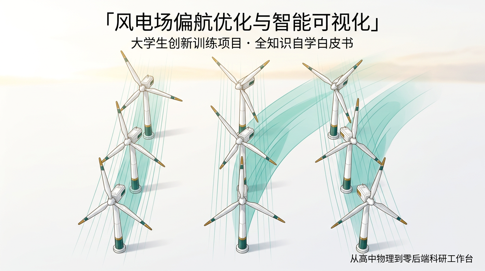

## 本书覆盖的证据范围（口径统一说明）

全书证据基座是**本仓库**，而非外部文献，统一按三类口径管理：

| 类别 | 口径 | 本书处理 |
| :--- | :--- | :--- |
| **数据资产** | 6 组扫描 CSV、NPZ 流场切片、4 个 JSON 结果、POD 分解输出 | 每讲数字绑定具体文件 |
| **代码资产** | 数据生成脚本 ×9、构建/门禁脚本 ×4、PPO 训练评测管线、15 页静态站、Streamlit 留档 | 每讲给出复算命令（附录 B） |
| **文档资产** | 大创申请书、HANDOFF/FREEZE 交接、审计台账 `AUDIT_20260810.md`、组会汇报、口袋手卡、PPO 交付文档 | 每讲标注引用位置 |

每讲章末元数据表标明**证据等级**：

- **A 级**：仓内复算核验（FLORIS 复算、SVD 重算、benchmark 复跑、契约自检），论述可回溯到具体文件与脚本；
- **B 级**：团队交付文档口径（PPO 交付报告、组会汇报、交接台账），未经仓内复算；
- **C 级**：申请书承诺口径（如「预测误差 <5%」「AEP +5~10%」），属**未来目标**而非实测结果，全书以不同标记呈现，严禁与 A/B 级混写。

## 三条写作铁律（不变）

1. **没有出处的话不写。** 百分比、倍数、样本量后有 `［来源：文件名］`；查不到就标 `［待核实］` 或不写。
2. **对不上的数字不填。** 与审计台账冲突时以审计台账为准（见第 12 讲的八大战）。
3. **没有边界的结论不交。** 每个数字必须带可信域与假设：FLORIS 是数值模拟不是现场实测；贪心解是局部下限；PPO 是 seed 42 单种子口径；ΔAEP 是等权简化口径。

## 怎么读这本书（请先读完本段）

### 深导师的五颗心法（本书的教学内核）

本书借鉴 AI 个性化导师系统 **DeepTutor**（HKUDS · Lifelong Personalized Tutoring）的心法，把「静态教科书」改造成「私人导师」：

1. **学习者建模（Learner Model）**：你不是一个均匀的「读者」。§0.5 按你的背景给路线；每讲的【深潜】框就是你的难度旋钮——第一遍读不懂可以整框跳过，知识不丢。
2. **掌握门（Mastery Gate）**：每讲章末有自测，**能复述 3 句口诀 + 答出 3 道自测**才配进入下一讲；做不出来就回到心智图，不要硬背符号。
3. **知识卡（Knowledge Cards）**：符号卡 / 口袋卡 / 值班卡都是「可截图」的。答辩前只复习卡片，不重读正文。
4. **证据落地（Grounded）**：DeepTutor 引用知识库「逐页引用」；本书引用仓库「逐文件引用」——每个数字可溯源，想质疑就去复算。
5. **记忆与反思（Memory & Reflection）**：每读完一讲，在地铁图（§0.5）上打勾；睡前朗读一遍 30 秒复述——主动回忆比重读有效。

### 主路 vs 深潜

每讲正文是**主路**：开场口诀 → 比喻 → 死穴 → 少数核心式 → 值班手册 → 比分 → 可信度。
标有 **【深潜｜可跳过】** 的框是加长跑道：公式、细节、口径辨析——**知识仍在**，第一遍读不懂可以整框跳过，第二遍再回来。

### 每讲固定导航条

1. **开场 90 秒**：反派绰号 + 3 句口诀 + 心智图
2. **§1 直觉剧场**：生活比喻（会贯穿全讲）
3. **§2 工程死穴**：有预算、有截止时间的现场
4. **§3 数学缓坡**：人话 → 符号卡 → 核心式 → 深潜
5. **§4 值班手册**：决策树优先于公式
6. **§5 比分日**：先胜负，再表格
7. **§6 可信度**：软肋打分 + 下一集预告
8. **章末**：30 秒复述 + 掌握门自测 + 元数据

### 五座过桥

篇与篇之间有「过桥」短章，专门帮你**换脑子**（物理 → 优化 → 降阶 → 强化学习 → 工程）。

### 若你时间很少

| 你有… | 建议路径 |
| :--- | :--- |
| **30 分钟** | 第零章 + 第 02 讲（25° 账本）+ 第 05 讲（四阶梯）+ 附录 D 口袋手卡 |
| **3 小时** | 第零章 → 01 → 02 → 05 → 07 → 10 → 12 |
| **一个学期** | 按目录顺序；深潜框第二遍再吃；按附录 B 亲手复算每讲数字 |

### 按角色选路

| 你是… | 主吃讲次 |
| :--- | :--- |
| 可视化与交互模块（前端） | 07 → 08 → 11 → 12 |
| CFD / 仿真模块 | 01 → 02 → 03 → 06 |
| 降阶与代理模块 | 07 → 08 → 04 |
| 优化与 PPO 模块 | 04 → 05 → 09 → 10 |
| 答辩主讲（全员通用） | 02 → 05 → 06 → 10 → 12 + 附录 D |

### 图怎么看

- **主路径默认中文图**；见到「指读」二字：请按左/右/箭头真的看图，不要跳过。
- 心智图 = 该讲地图；记分板 = 证据；口袋卡 = 答辩保命符。

### 完全零基础 / 有数学 / 要做研究 / 要复现

- **零基础**：必须先第零章；再 01，且允许跳深潜。
- **有数学**：深潜框是你的主菜。
- **要做研究**：每讲 §6 软肋 = 选题富矿（第六篇 6.3 已长成清单）。
- **要复现**：附录 B。

---

> 📖 **阅读体验建议：** 犯困时不要硬刚公式——回到开场三句口诀，出声读一遍章末 30 秒复述，再继续。本书故意写长，是为了把密度摊薄，不是为了堆字数。

---

## 定稿状态（2026-09-09）

| 项 | 口径 |
| :--- | :--- |
| 讲次 | 12/12 + 第零章 + 5 座过桥 + 第六篇批判前瞻 |
| 单讲配图 | 1~2 张主路径中文教学图（全书 19 张） |
| 公式 | Unicode 纯文本（〔式〕标记），禁止美元符数学环境与裸 LaTeX |
| 数字 | 百分比/倍数/次数断言带来源；图注含数字带出处 |
| 工况红线 | FLORIS = 模拟非实测；贪心 = 下限；PPO = seed 42；XGBoost = 图源级佐证；ΔAEP = 等权简化 |
| 装配 | 本文件由 `whitepaper_src/` 源文件装配 |
| 验收 | 图片引用齐全、无 LaTeX 残留、与审计台账逐条对账 |

> 📌 修改讲稿请只改 `whitepaper_src/`，再重新装配。

---

## 目录

- [第零章 极简前置铺垫：初高中物理/数学如何托起风电场偏航优化？](#ch0)
  - [0.1 风机到底是个啥？](#ch0-1)
  - [0.2 什么是尾流？——风机身后的「风贼」](#ch0-2)
  - [0.3 为什么「让上游转一点」能赚钱？](#ch0-3)
  - [0.4 这个项目在做什么？——五人、三组数据契约](#ch0-4)
  - [0.5 12 讲路线「地铁图」](#ch0-5)
  - [0.6 第零章自测（3 题）](#ch0-6)
- [【第一篇 尾流物理与快速仿真】](#part-1)
  - [过桥 A · 从第零章到第 01 讲](#bridge-a)
  - [【第01讲】尾流：让全场变穷的「风贼」（反派：风贼）](#lec-01)
  - [【第02讲】偏航转向：用自己的风，换全场的风（反派：自损）](#lec-02)
  - [【第03讲】FLORIS：把纳维-斯托克斯变成毫秒计算器（反派：慢如蜗牛）](#lec-03)
- [【第二篇 偏航优化】](#part-2)
  - [过桥 B · 从仿真到优化](#bridge-b)
  - [【第04讲】最优偏航角怎么搜（反派：瞎搜）](#lec-04)
  - [【第05讲】3×3 九机阶梯让利（反派：一刀切）](#lec-05)
  - [【第06讲】风玫瑰与 AEP：别拿一个风向说全年（反派：单风向）](#lec-06)
- [【第三篇 降阶与代理推理】](#part-3)
  - [过桥 C · 从优化到降阶](#bridge-c)
  - [【第07讲】POD：把 8192 维流场压成两笔（反派：全存）](#lec-07)
  - [【第08讲】代理模型与端侧推理：在浏览器里解流场（反派：贵如登月）](#lec-08)
- [【第四篇 强化学习 PPO】](#part-4)
  - [过桥 D · 从「搜」到「学」](#bridge-d)
  - [【第09讲】为什么不每次重新优化：PPO 闭环（反派：每次重算）](#lec-09)
  - [【第10讲】物理可达域：风机为什么转不出 50%（反派：追风）](#lec-10)
- [【第五篇 可视化工程与诚信审计】](#part-5)
  - [过桥 E · 从数字到「最后一公里」](#bridge-e)
  - [【第11讲】零后端静态站：没有服务器的科研工作台（反派：脆如玻璃）](#lec-11)
  - [【第12讲】诚信审计：数字的八大战（反派：假数字）](#lec-12)
- [第六篇 【对比、批判与前瞻篇】](#part-6)
  - [6.0 十二讲口诀墙（一张纸版）](#sec-6-0)
  - [6.1 全景对比矩阵](#sec-6-1)
  - [6.2 横向批判：六个共享软肋](#sec-6-2)
  - [6.3 前瞻选题：从六个软肋直接生长出来](#sec-6-3)
  - [6.4 已删除的旧版虚构数字（公示，避免复现）](#sec-6-4)
  - [6.5 全书收口：一句话版](#sec-6-5)
- [附录](#appendix)
  - [附录 A 符号总表](#app-a)
  - [附录 B 复现指南](#app-b)
  - [附录 C 术语表（中英对照）](#app-c)
  - [附录 D 口袋手卡（进组会会议室前 3 分钟）](#app-d)
  - [附录 E 团队与里程碑](#app-e)
  - [全书终测（10 题 · 掌握门）](#final-quiz)

---
<a id="ch0" name="ch0"></a>
# 第零章 极简前置铺垫：初高中物理/数学如何托起风电场偏航优化？

很多刚进大学的同学，一看到「尾流偏转」「高斯尾流模型」「POD 本征正交分解」「近端策略优化」就心里发怵。别怕——**所有看似高不可攀的工程黑科技，其物理地基都在你初中和高中学过的知识里。** 本章只用初高中水平的物理与数学，把后面 12 讲要用到的三件事讲清楚。

---

<a id="ch0-1" name="ch0-1"></a>
### 0.1 风机到底是个啥？

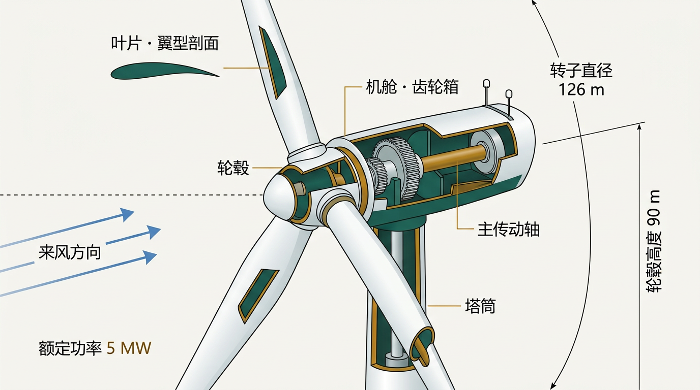

> **指读：** 从上到下：叶片 → 轮毂 → 机舱 → 塔筒；右侧两条尺寸线（90 m / 126 m）是决定后面所有流场的两个数字。

把风机简化到极致：一台**会发电的风扇**。风来 → 扇叶转 → 发电机发电。高中物理三点就够：

**① 功率来自风的动能（能量守恒）**
每秒流过转子截面的空气携带动能，风机从中「抽走」一部分变成电：
**〔式〕** P = ½ · ρ · A · v³
- ρ 空气密度 ≈ 1.225 kg/m³（高中物理常量）；
- A = π·R² 转子截面积（本项目 R = 63 m［README：转子标称 126 m］）；
- v 风速——**注意是三次方**。

**这个式子意味着：风速翻倍，功率理论上变 8 倍**——只是风机有额定天花板（5 MW @ 11.4 m/s），超了就不再加。本项目数据口径：单机 6 m/s 发 731 kW、8 m/s 发 1754 kW（正好 2.37 倍 ≈ (8/6)³）、12 m/s 发 5000 kW（触额定封顶，理论 8 倍被截断成 6.8 倍）［cases.csv / cases_multi.csv］——这就是「风电场的功率由风说了算」。

**② 贝兹极限：风的钱不能全拿**
1919 年 Betz 证明：无论设计多好，风机最多只能拿走风能动能的 **59.3%**［14_DAYS_MASTER_PLAN］。为什么？把 100% 拿走，你身后的风就停了，后面的风也进不来——**风机必须「让一部分风过去」，才能持续发电**。
记住这句话，它后面会变成全书的主题：上游机组的任务，**不是自己拿满，而是给下游留风**。

**③ 本项目的台机：NREL 5MW［README］**

| 参数 | 数值 |
| :--- | :--- |
| 额定功率 | 5 MW @ 11.4 m/s |
| 轮毂高度 | 90 m |
| 转子直径 | 126 m（半径 63 m） |

这是开源基准风机，团队全部流场与功率都按它计算。PPO 环境里的 P_base 公式用的也是 R=63 m（0.5·ρ·π·63²·C_P·u³）［simplified_turbine_env.py］——两个模块的「台子」是同一台风机，这是后文数字能互相咬合的前提。

---

<a id="ch0-2" name="ch0-2"></a>
### 0.2 什么是尾流？——风机身后的「风贼」

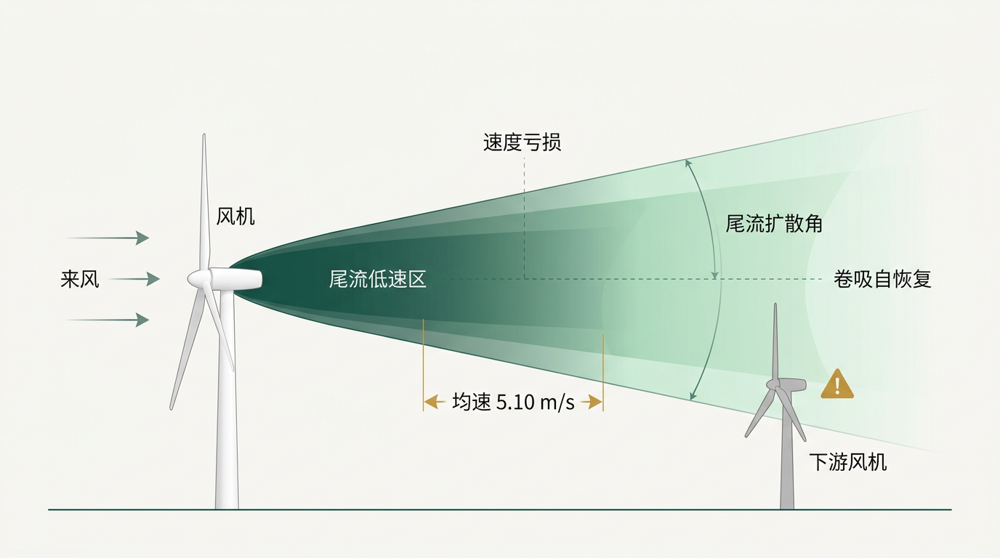

> **指读：** 风机后面那团深绿色锥形 = 低速尾流；颜色越往后越浅 = 风速自己在恢复；右下角那台灰色风机正好站在尾流里——警示牌就是本讲反派「风贼」。

风穿过转子时，转子抽走了一部分动能与动量。下游空气吃到的，是**已经被「抽过」的风**：
- **风速变低**（速度亏损）：本项目 5D 间距的下游机，0° 对风时转子平均风速只有 **5.10 m/s**——比清洁来流 8 m/s 低了 36%［README 数据口径 / AUDIT C］；
- **湍流变大**：尾流不是安静的「慢空气」，而是混乱的；
- **它会自己恢复**：周围干净空气被「卷吸（entrainment）」进来，尾流风速随距离回升——**这就是为什么第三排比第二排还快**（第 05 讲细说）。

高中物理就够：**动量守恒**——转子对空气做功（抽功率），空气就必须「付账」：下游风速降低。

---

<a id="ch0-3" name="ch0-3"></a>
### 0.3 为什么「让上游转一点」能赚钱？

先不推导，先给结论（第 02 讲把它算死）：把上游机**偏航（yaw）25°**，它自己少发 16.8% 的电，但它的尾流被「推歪」，躲开了下游机——下游从 436 kW 涨到 909 kW，**全场净赚 +8.13%（+178 kW）**［HANDOFF 可信数字］。

一句话剧透：**偏航转向 = 上游「让利」，下游「找补」，全场的账是算总收益。**

> **先猜后揭：** 转得越多是不是越好（30° > 25° > 20°）？
> 揭晓在第 05 讲：**错**。20° 比 30° 更优——让利存在「平衡点」，这是全书最反直觉、也最值得背的数字之一。

---

<a id="ch0-4" name="ch0-4"></a>
### 0.4 这个项目在做什么？——五人、三组数据契约

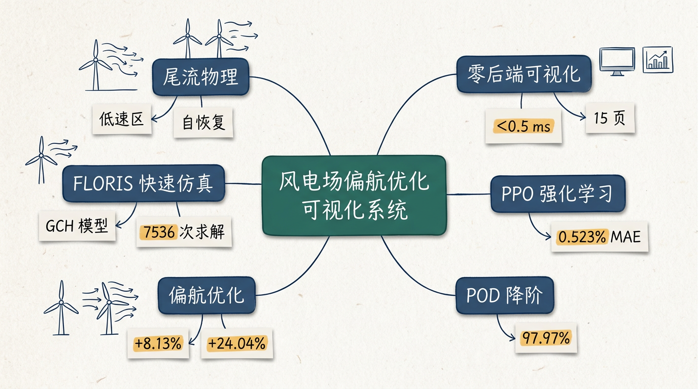

> **看图三秒：** 中心是系统名，六条分支就是本书的五个篇章；每张便签上的数字（+24.04%、97.97%、0.523%、<0.5 ms）是各篇的「比分」。

项目：「风电场偏航优化可视化系统」（大创申请书题名：融合数据-物理驱动的风电流场感知与智能调控研究［申请书 2026-03-27］）。五人分工［README / 申请书］：

| 成员 | 分工 | 对应讲次 |
| :--- | :--- | :--- |
| 田铭雨 | CFD 仿真（流场数据） | 01–03 |
| 袁夫达 | POD 降阶 / 代理模型 | 07–08 |
| 厉今飞 | 基线数据（项目主持） | 04–06 |
| 洪祖名 | 优化与 PPO 强化学习 | 04、09–10 |
| 孙承泽 | 可视化与交互系统（15 页静态站） | 11–12 |

指导教师：李良星 副教授（动力工程多相流国家重点实验室，多相流动与传热方向）［README / 申请书］。

**项目一句话定位**：**把流场算便宜（FLORIS）→ 把最优解搜快（插值/优化/贪心）→ 把模型做小（POD/代理）→ 让机器自己学会跟踪（PPO）→ 最后全部装进一个断网也能用的网页（零后端）。**

模块之间靠**三组数据契约**对话（字段形状不可变更）［README 数据契约］：

| 组 | 契约 | 形状/域 |
| :--- | :--- | :--- |
| 仿真组 | `cases.csv` + `fields/*.npz` | u(64,128) m/s，绝对风速不归一化 |
| 控制组 | `find_yaw_for_target(target, U) → (best_yaw, P, err%)` | 目标功率反求偏航 |
| AI 组 | `predict_power(yaw, U) → {p1, p2, ptot, outOfRange, reasons}` | 可信域 6~12 m/s、±30° |

> **导师提问：** 为什么「字段形状不可变更」比「实现随便改」更重要？——因为五个人各写各的代码，**契约是五个人协作的接口法**（第 08 讲展开）。

---

<a id="ch0-5" name="ch0-5"></a>
### 0.5 12 讲路线「地铁图」

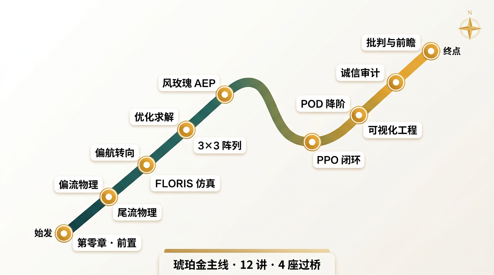

> **把这张图截下来。** 以后每读完一讲，就在对应站点打勾——比你「感觉读了很多」可靠。

```text
第零章 前置（高中物理三件套：v³、贝兹、动量守恒）
    │
    ├─ 第一篇 尾流物理与快速仿真 ── 01 风贼 → 02 自损 → 03 慢如蜗牛
    ├─ 第二篇 偏航优化          ── 04 瞎搜 → 05 一刀切 → 06 单风向
    ├─ 第三篇 降阶与代理推理    ── 07 全存 → 08 贵如登月
    ├─ 第四篇 强化学习 PPO      ── 09 每次重算 → 10 追风
    └─ 第五篇 可视化与诚信审计  ── 11 脆如玻璃 → 12 假数字
          └─ 第六篇 批判与前瞻（软肋 = 选题富矿）
```

> 主线一句话：**先把「下一次评估」变聪明（第二篇），再把「一次评估」变便宜（第一、三篇），最后让机器学会物理本身（第四篇）——并用制度守住所有数字（第五篇）。**

---

<a id="ch0-6" name="ch0-6"></a>
### 0.6 第零章自测（3 题 · 掌握门）

1. 风速从 6 m/s 到 12 m/s（翻倍），单机功率大约变成几倍？风机为什么不能拿走 100% 的风能？
2. 尾流不是「安静的慢空气」，它是什么？它凭什么「自己恢复」？
3. 用一句话说出这个项目的「三便宜、一小、一学、一离线」。

<details>
<summary>参考答案</summary>

1. 8 倍（P ∝ v³）；拿 100% 会让身后风停下、新风进不来——贝兹极限 59.3% 是硬顶［14_DAYS_MASTER_PLAN］。
2. 是**湍流增强的混乱低速区**；周围干净空气卷吸（entrainment）进来，风速随距离自恢复——证据在第 05 讲：第三排均速 5.31 m/s > 第二排 5.10 m/s［README］。
3. 算得便宜 = FLORIS（7536 次求解 339 s）；搜得快 = 插值 + 优化器（0.6 ms 实时）；做得小 = POD/代理（97.97%、26.4 KB）；学得会 = PPO（MAE 0.523%）；离线用 = 15 页零后端静态站（断网可讲）。

</details>

> **下一集预告：** 第 01 讲的反派叫「风贼」——上游拿得越多，下游越穷，全场总账其实亏了一大笔，而且亏得很安静。

---
<a id="part-1" name="part-1"></a>
# 第一篇 【尾流物理与快速仿真】

本篇覆盖**第 01、02、03 讲**。这一条主线回答一个问题：**下游机吃了上游的尾流，到底亏了多少、怎么算？** 先看尾流是什么（01），再看怎么「推歪」它（02），最后看为什么不用重 CFD 而用毫秒级快算子（03）。

<a id="bridge-a" name="bridge-a"></a>
### 过桥 A · 从第零章到第 01 讲：问题已经清楚，答案从「风机身后」开始

第零章结束时，你手里只有三件高中物理：能量守恒（v³）、贝兹（不能拿满）、动量守恒（转子推空气）。
从现在起，第一篇（第 01–03 讲）给出第一条主线答案：**把尾流看懂，把「谁让谁」的账算清。**

| 你将依次遇见 | 它专治的病 |
| :--- | :--- |
| 第 01 讲 尾流 | 「下游变穷但没人知道为什么」 |
| 第 02 讲 偏航转向 | 「上游让利像是吃亏」 |
| 第 03 讲 FLORIS | 「风向这么多，扫描算不动」 |

**阅读纪律（本篇通用）：**

1. 先读开场 90 秒的三句口诀；
2. 图看懂了再啃〔式〕；
3. 深潜框可跳，知识不丢；
4. 章末自测做不出来，回到心智图，不要硬背符号。

下一页反派登场，它的名字叫**风贼**。

---

<a id="lec-01" name="lec-01"></a>
### 【第01讲】尾流：让全场变穷的「风贼」（反派：风贼）

#### 本讲开场 90 秒

**上讲闪回（第零章）：** 风机 = 会发电的风扇，P ∝ v³，贝兹 59.3% 说不能拿满。

**本讲反派：** 「风贼」——上游机的尾流让下游机风速腰斩，全场总功率每天安静地少一千多 kW（本讲 §5 算出 ≈1317.6 kW）。

**只要带走 3 句口诀：**

1. **尾流 = 低速 + 高湍流**：下游吃的是「被抽过的风」。
2. **越远越好**：卷吸自恢复，第三排比第二排快。
3. **间距定命运**：5D（630 m）是本项目的试验台［README］。


> **看图三秒：** 深绿锥体 = 低速尾流；远端颜色变浅 = 自恢复；右下灰色机坐在尾流正中间——它就是受害现场。

**本讲赌注：** 不讲清尾流，第 02 讲的 +8.13% 就永远只是一个数字。

---

#### 1. 生活与物理直觉引子：风洞里的两碗面

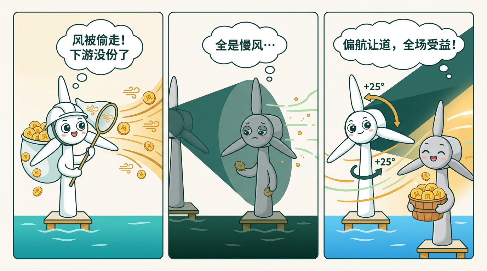

> **指读：** 左格上游机举网捞「风币」；中格下游机站在阴影里只捞到两枚；右格上游机把转子倾斜 +25°，阴影被推歪，下游机捞满一筐。

假设风是从西往东的「金币河」，每台风机会发电的店：
- **上游店**站在河中央，捞币最多；
- **下游店**站在上游店制造的「币影」里——币少、水流乱（湍流）；
- 两店「总营收」永远小于 2 倍单店营收。

| 生活元素 | 工程元素 | 本讲符号（先混个眼熟） |
| :--- | :--- | :--- |
| 金币河 | 来流风速 | u∞（8 m/s） |
| 币影 | 尾流低速区 | 速度亏损 u∞ − u |
| 乱流 | 尾流湍流强度 | TI（本项目 6%） |
| 两店距离 | 机组间距 | 5D = 630 m |
| 两店总营收 | 全场功率 | Ptot（kW） |

> **先猜后揭：** 尾流低速区里，是「风被堵住了」还是「风被推歪了」？
> 揭晓在 §3：**两者都有**——动量亏损（慢）+ 横向偏转（歪）并存。

**风贼的三招（加长）：**
1. **抽**：转子抽取动量，下游风速必须降（动量守恒）；
2. **搅**：叶尖涡持续搅拌，湍流强度升高；
3. **收**：卷吸——周围干净空气被拖进来，尾流自恢复。**第三招是风贼的破绽，也是全场「让利策略」的地基。**

---

#### 2. 工程死穴：5D 串列的现场

场景：两台机串列，间距 5D = 630 m［README］，风速 8 m/s，湍流强度 6%。

如果两台都对风（0°）：
- 上游机 T1 一切正常；
- T2 站在 T1 尾流正中间，**转子平均风速只有 5.10 m/s**——比清洁来流 8 m/s 低 36%［AUDIT C］；
- 全场总功率只有 **2190.39 kW**［HANDOFF 可信数字］。

**这个 36% 的亏损，肉眼不可见**（风机还在转、电网还有读数），但每天都在悄悄漏掉。现场的问题是：**不添机、不占地，能不能让 T1 把 T2 的风「让」回来？**

---

#### 3. 数学公式从 0 到 1：风是怎么被「偷」的

先把公式关掉。只用面馆语言说一遍：

> T1 从金币河里抽走一部分动量（贝兹上限 59.3%，实际功率系数约 45%［simplified_turbine_env.py C_P=0.45］）。它身后的「币影」有宽度：影内风速低于影外；影子随距离变宽（尾流扩散），还被往旁边推（偏转，第 02 讲）。

##### 3B. 本讲符号卡（建议截图留存）

| 符号 | 人话 | 备注 |
| :--- | :--- | :--- |
| u∞ | 来流风速 | 本讲 8 m/s |
| u(x,y) | 尾流内局部风速 | 64×128 网格切片 |
| 亏损 | u∞ − u | 风贼的账 |
| TI | 湍流强度 | 本项目 6%（隐藏变量） |
| D | 转子直径 | 126 m |
| 5D | 两机间距 | 630 m |

##### 3C. 主路径只要两条式

**核心式 ① — 速度亏损的高斯结构（FLORIS GCH 模型）［README：FLORIS 4.6.6 GCH 默认配置］**
尾流任意一点的速度亏损，从尾流中心按「钟形曲线」（高斯）衰减：
**〔式〕** Δu(y) = Δu_center · exp( −y² / (2σ²) )
**回译：** 中心最深、边缘最浅；σ 是尾流的「宽度」，越往下游走越宽。FLORIS 的 GCH = 高斯速度亏损 + 高斯偏转 + 二次转向 + 偏航附加恢复 + 横向速度［README］。

**核心式 ② — 风速立方律，功率跟着跑（呼应 0.1 节）**
**〔式〕** P ∝ u³（非额定风域近似）
**回译：** 均速 5.10 m/s 对 8 m/s → 功率比 ≈ (5.10/8)³ ≈ 0.257。
**但注意**：实际下游单机 436.4 kW / 1754 kW ≈ 24.9%，与纯立方不完全相等——功率曲线、盘均口径、功率系数修正都会介入。**口径以 `cases.csv` 为准，不用 v³ 直接估全场功率**（这是全书的数字纪律，见第 12 讲）。

> 【深潜｜可跳过】
>
> 为什么实际亏损比纯立方「温和」一点？NREL 5MW 额定 11.4 m/s，6~11.4 m/s 段近似立方，但「转子盘均风速」与「功率曲线所用轮毂风速」口径不同，FLORIS 功率曲线映射还带功率系数修正。审计原则「对不上的数字不填」在这里的用法是：**两个口径都对，但只能引用一个，且注明是哪个**［AUDIT A 原则］。

---

#### 4. 值班手册：看到风电场先问三句

```text
1. 间距多少？ → <3D 干涉重；5D 本项目；>10D 尾流基本恢复
2. 风向多少？ → 「排轴」正对风向最疼（哪些方向见第 06 讲）
3. 几排？     → 排越深被「多重征税」，但离源越远恢复越多（第 05 讲）
```
**一句话记住：先问间距、再问风向、再问排数——三句问完，尾流账的量级就有了。**

---

#### 5. 比分日

**先报胜负：** 0° 全对风，下游机转子均速 **5.10 m/s**，全场 **2190.39 kW**——风贼的总账单 ≈ **1317.6 kW**（下游「本可」1754 − 实际 436.4）［cases.csv case_0007 导出］。

| 观察点 | 数值 | 来源 |
| :--- | :--- | :--- |
| 下游转子均速（0°） | 5.10 m/s | AUDIT C |
| 上游单机 | 1754 kW | cases.csv case_0007 |
| 下游单机 | 436.4 kW | cases.csv（2190.39 − 1754） |
| 全场 | 2190.39 kW | HANDOFF 可信数字 |
| 干涉损失口径 | ≈1317.6 kW | 上两行导出（若 T1 不存在，T2 吃清洁风 ≈1754） |

**怎么读这张表：** 先看 436.4——这是下游的「伤口」；后面所有让利策略，都是为这个数字服务的。

---

#### 6. 可信度

| 维度 | 打分 | 人话 |
| :--- | :---: | :--- |
| 机理 | 5 | 动量守恒 + 卷吸，第一性原理级 |
| 数据 | 5 | FLORIS 复算、位级一致 |
| 模型边界 | 3 | GCH 是稳态工程模型，无时变尾流蜿蜒 |
| 外推 | 3 | 5D/8 m/s 口径成立；其他间距需重算 |

**可以攻击的点：** ① 稳态模型，无尾流蜿蜒/湍流时程；② TI=6% 是固定假设；③ 平坦地形、无真实地形项。
**承前：** 动量理论（贝兹）→ **启后：** 第 02 讲——怎么用 25° 的旋转，把这个「风贼」推走。

**附：口袋卡（可打印）**
> **风贼账本（5D · 8 m/s · 0°）**
> 下游均速 5.10 m/s ｜ 下游 436.4 kW ｜ 干涉损失 ≈1317.6 kW ｜ 全场 2190.39 kW
> 三招：抽、搅、收（收是破绽）。

---

#### 章末：30 秒复述 · 掌握门自测

**30 秒复述稿（可朗读）：** 风贼 = 上游尾流让下游穷：低速（5.10 m/s）、高湍流、自恢复（卷吸）。5D 间距、8 m/s，下游只发 436 kW，全场 2190 kW。反派「风贼」，破绽「自恢复」。

**自测（先做再对答案）：**

1. 下游机风速低 36%，为什么功率不是「正好少 36%」？
2. 「卷吸自恢复」是什么？哪一讲哪个数字是它的证据？
3. 值班手册「三问」是哪三问？

<details>
<summary>参考答案</summary>

1. P ∝ v³ 是低风域近似；实际功率曲线、盘均风速口径、功率系数修正都会介入，口径以 cases.csv 为准。
2. 周围干净空气被拖进尾流，风速随距离自恢复；证据在第 05 讲：第三排均速 5.31 > 第二排 5.10 m/s（10D 自恢复）［README］。
3. 间距、风向、排数。

</details>

**元数据：** 证据等级 A（FLORIS 复算）｜复算路径 `cases.csv` case_0007｜关联页 `wake.html` `overview.html`。

---

<a id="lec-02" name="lec-02"></a>
### 【第02讲】偏航转向：用自己的风，换全场的风（反派：自损）

#### 本讲开场 90 秒

**上讲闪回（第 01 讲）：** 风贼账本——下游 436.4 kW，干涉损失 ≈1317.6 kW。

**本讲反派：** 「自损」——直觉认为「转 = 亏」：上游转 25°，自己少发 16.8%，像是纯亏。

**只要带走 3 句口诀：**

1. **转多少度，就少接多少风**：cos(γ)^1.88，25° 就是让利 16.8%。
2. **CVP 把尾流推歪**：反向涡对把整条尾流侧偏 43~52 m。
3. **让 16.8%、找补 108.4%、净赚 8.13%**：全场的账。

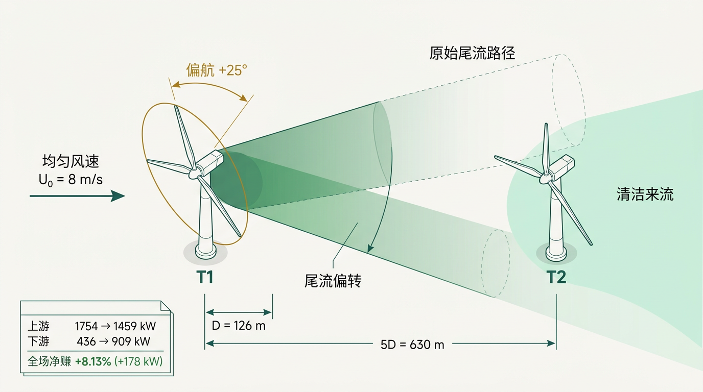

> **看图三秒：** 琥珀金弧线 = 上游 25° 让利；绿色锥体 = 被推歪的尾流；虚线幽灵锥 = 若不偏航，下游被砸的「原始尾流路径」；左下账本卡 = 本讲全部比分。

**本讲赌注：** +8.13% 不是魔法，是「让 295、找补 473」的算术。

---

#### 1. 生活与物理直觉引子：雨天打伞的人

> **剧场：** 两人共用一把伞。前面的人把伞**斜一点**（偏航），后面的人不再那么湿（吃到干净来流）；代价是前面的人自己肩头多湿了一点（余弦损失）。伞斜 25° 时两人「总湿量」最低——斜 45° 反而两个人都湿。

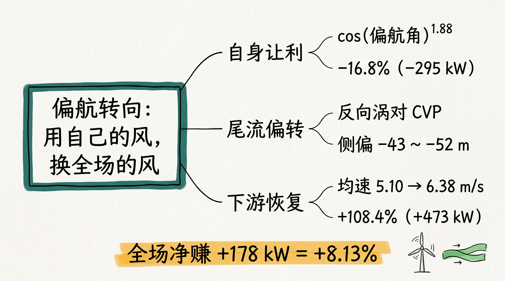

> **指读：** 三条分支「自身让利 / 尾流偏转 / 下游恢复」正是 §5 账本的三行；底部高亮条「全场净赚 +178 kW = +8.13%」是本讲结论。答辩前只看这张图。

| 生活元素 | 工程元素 | 本讲符号 |
| :--- | :--- | :--- |
| 伞的角度 | 偏航角 γ | ±30°（机械限位） |
| 自己多湿一点 | 余弦功率损失 | cos^1.88(γ) |
| 雨帘被推歪 | 尾流偏转 | 偏移 −43~−52 m |
| 后面人不湿了 | 下游恢复 | 436 → 909 kW |

> **先猜后揭：** 25° 和 30°，哪个更好？直觉说「转得多推得远」——
> 揭晓：网格扫描里 25° 是 13 点网格最优；连续搜索的最优是 **26.6°**［AUDIT H］。30° 更差：自己的余弦损失追不上下游的额外收益（第 05 讲的 20° vs 30° 是同一结构的放大版）。

---

#### 2. 工程死穴：偏航限位的现场

同一个现场（5D 串列、8 m/s），加上三条现场约束：

- 偏航系统**只能转 ±30°**（机械限位）［PPO 交付契约：yaw clip ±30°］；
- 不能天天转：偏航驱动有磨损、转速慢（第 09 讲 PPO 的 ±5°/step 动作域就是为它设的）；
- 电网不关心哪台转——**只看总功率**。

问题：**在 ±30° 内，转多少度让全场总功率最大？**

---

#### 3. 数学公式从 0 到 1：一笔让利的两本账

先用伞的话说一遍：

> 上游把伞斜 γ 角 → (a) 自己接雨的「投影面积」变小 → 功率 ×cos^1.88(γ)；(b) 雨帘（尾流）中心线被斜向分量推歪 → 下游躲开阴影。

##### 3B. 本讲符号卡

| 符号 | 人话 | 备注 |
| :--- | :--- | :--- |
| γ | 偏航角 | ±30° |
| cos^1.88(γ) | 单机功率比 | γ=25° → 0.831 |
| 偏移 | 尾流中心线侧移 | −43~−52 m @3~4D（−y 侧） |
| P1(γ)/P2(γ) | 上/下游功率 | FLORIS 口径 |
| Gain | (Ptot−Pbase)/Pbase | +8.13% @25° |

##### 3C. 主路径只要两条式

**核心式 ① — 余弦损失［simplified_turbine_env.py / FLORIS 原生指数 1.88］**
**〔式〕** P1(γ) = P1(0) · cos^1.88(γ)
**回译：** γ=25° → cos25° = 0.9063 → 0.9063^1.88 ≈ 0.831 → 1754 × 0.831 ≈ **1459 kW**，让利 **295 kW**。

**核心式 ② — 全场账**
**〔式〕** Gain = (P1(γ)+P2(γ) − P1(0)−P2(0)) / (P1(0)+P2(0))
**回译：** (1459+909 − 1754−436.4) / 2190.39 = 178 / 2190.39 = **+8.13%**。

> 【深潜｜可跳过】
>
> - **为什么指数是 1.88 而不是 1（或 3）？** 纯几何投影（面积×弦向攻角退化）应接近 cos³；1.88 是 FLORIS 偏航功率损失模型的工程经验指数——转身后叶片仍有攻角，还能接住一部分风。留档 Streamlit 工具里曾出现 cos^1.5 启发式，审计已标注与 FLORIS 原生 1.88 的偏差（留档工具不改行为，站点 JS 无此问题）［AUDIT 六］。
> - **偏移怎么来的？** GCH 偏转项：偏移量随顺流距离增长，x=400 m → −42.9 m，x=500 m → −52.4 m（−y 侧），多站位验证［AUDIT D，case_0012.npz］。
> - **±γ 并不严格镜像对称**：+25° 总功率 2368.40 kW vs −25° 的 2350.81 kW（差 <0.8%），来源是横向速度项与偏航附加恢复项的符号耦合［cases.csv case_0002 / case_0012］。

---

#### 4. 值班手册

```text
问「让利多少」   → cos^1.88(25°) ≈ 0.831 → 16.8%（295 kW）
问「尾流推多远」 → 43~52 m @3~4D，−y 侧
问「转了划不划算」→ 让 295、找补 473、净赚 178 → 划算
问「为什么不是 30°」→ 30° 让利 23.7%，尾流推得更远但自身损失追不回来（第 05 讲同构）
```
**一句话记住：让利是「预付款」，下游找补是「连本带利」，25° 是利息峰值（13 点网格口径；连续口径 26.6°）。**

---

#### 5. 比分日

**先报胜负：** +25° 击败 0°：2190.39 → 2368.40 kW，**+8.13%（+178 kW）**，本地复现偏差 <0.01 kW［HANDOFF 可信数字 / README 数据口径］。

**两机 25° 让利账本（本讲核心资产）：**

| 项 | 0° | +25° | 变化 |
| :--- | :---: | :---: | :---: |
| 上游 T1 | 1754 kW | 1459 kW | −295（−16.8%） |
| 下游 T2 | 436.4 kW | 909 kW | +473（+108.4%） |
| T2 转子均速 | 5.10 m/s | 6.38 m/s | +1.28 |
| 全场 | 2190.39 kW | 2368.40 kW | **+178（+8.13%）** |

来源：T1 1459/−16.8%、T2 909/+108.4%［口袋金句手卡］；5.10→6.38［AUDIT C/D］；全场 2190.39/2368.40［HANDOFF］。

**怎么读这张表（很关键，别读错）：**
- 先看最后一行：+178 kW 才是「真赢」；
- 上游 −295 是**成本**，下游 +473 是**回报**——**回报/成本 ≈ 1.6**，这是让利结构上划算的原因；
- 若被问「上游亏了吗」：单看它亏，合在一起赚——**这就是集群控制的本质**。

---

#### 6. 可信度

| 维度 | 打分 | 人话 |
| :--- | :---: | :--- |
| 机理 | 5 | 余弦损失 + 涡对偏转，两条式说清 |
| 数据 | 5 | 位级复现（偏差 <0.01 kW） |
| 策略最优性 | 3 | 13 点网格最优 25°；连续搜索 26.6°（第 04 讲） |
| 泛化 | 2 | 5D/8 m/s 口径；其他风向见第 06 讲 |

**可以攻击的点：** ① 稳态、单风向；② ±30° 限位下 25°/26.6° 才是最优，若限位放开，最优点移动；③ 只两台机，九台见第 05 讲。
**承前：** 第 01 讲风贼（亏损+扩散）→ **启后：** 第 03 讲——这 13 个角度是怎么「一眨眼的功夫」算出来的。

**附：口袋卡（可打印）**
> **25° 让利账本**
> 让 cos^1.88(25°)≈16.8%（−295 kW）｜ 尾流推歪 43~52 m ｜ 找补 +108.4%（+473 kW）
> 全场净赚 +178 kW = +8.13% ｜ 回报/成本比 ≈1.6

---

#### 章末：30 秒复述 · 掌握门自测

**30 秒复述稿（可朗读）：** 偏航转向 = 用自己的风换全场的风：上游让利 16.8%（−295 kW），CVP 把尾流推歪 43~52 m，下游找补 108.4%（+473 kW），全场净赚 178 kW = 8.13%。反派「自损」，破绽「回报成本比 1.6」。

**自测（先做再对答案）：**

1. 余弦损失的指数为什么是 1.88 而不是 1（或 3）？
2. 账本里上游亏、下游赚，全场凭什么算「赢」？
3. 「+25° 最优」与「+26.6° 最优」差在哪？答辩时该说哪个？

<details>
<summary>参考答案</summary>

1. 纯投影 cos³；1.88 是 FLORIS 原生经验指数（叶片仍有攻角，能接住一部分风）；留档工具 cos^1.5 已被审计标注为口径偏差。
2. 总功率 2368.40 > 2190.39；结构证明是回报/成本比 ≈1.6。
3. 25° 是 13 点网格（−30~30 步长 5°）最优，26.6° 是连续搜索（2370.5 kW）——说「最优」必须带「口径」二字［AUDIT H］。

</details>

**元数据：** 证据等级 A｜复算路径 `cases.csv` case_0007/case_0012｜关联页 `wake.html` `optimization.html`。

---

<a id="lec-03" name="lec-03"></a>
### 【第03讲】FLORIS：把纳维-斯托克斯变成毫秒计算器（反派：慢如蜗牛）

#### 本讲开场 90 秒

**上讲闪回（第 02 讲）：** 25° 账本算清了——但那是「一个角度一次算」。

**本讲反派：** 「慢如蜗牛」——高保真 CFD 单工况小时级到数天［申请书「单工况模拟需数小时至数天」］，12 风向 × 4 风速 × 13 偏航角根本扫不完。

**只要带走 3 句口诀：**

1. **CFD 准但贵，FLORIS 糙但快**：用精度换速度。
2. **GCH = 高斯 + 偏转 + 恢复 + 横速**：快模型的五件套［README：FLORIS 4.6.6 默认 GCH 配置］。
3. **7536 次求解 / 339 s**：全书数字的速度底座［AUDIT 五］。

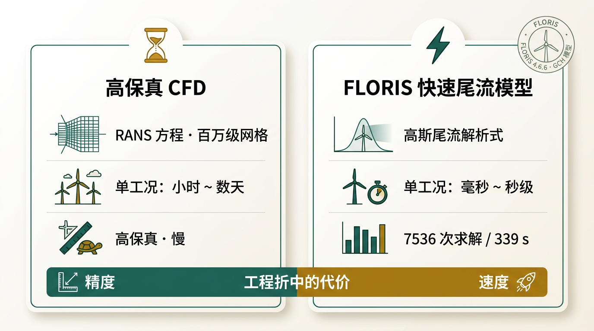

> **看图三秒：** 左卡 CFD（沙漏，小时~数天），右卡 FLORIS（闪电，毫秒~秒级），底部对比条「精度 vs 速度：工程折中的代价」。

**本讲赌注：** 没有 FLORIS，就没有 +24.04%、ΔAEP +8.86% 与 <0.5 ms 的网页——本书所有数字都站在它头上。

---

#### 1. 生活与物理直觉引子：导航与实测

> **剧场：** CFD = 自己开车实测每条路段（准，但全网跑完要一个月）；FLORIS = 导航的「路线预估」（路网结构 + 交通模型，一秒出全网方案）。导航预估不是「真实通行时间」，但够你**选路**。

| 导航元素 | 仿真元素 |
| :--- | :--- |
| 实开实测 | CFD / RANS |
| 路线预估 | FLORIS GCH |
| 交通模型 | 高斯尾流 + 偏转 + 恢复 + 横速 |
| 选路 | 最优偏航角搜索 |

> **先猜后揭：** FLORIS 的预估与 CFD 差多少？
> 揭晓：**［待核实］——本项目未做 CFD-FLORIS 对照实验**。本书的精度口径是「FLORIS 官方模型 + 本地位级复现自洽」，不是「对照真值验证」。这是第 12 讲「诚信」的正面案例：**查不到就标待核实，不写。**

---

#### 2. 工程死穴：扫描任务单

风玫瑰扫描任务（第 06 讲的弹药）：12 风向 × 4 风速 × 双通道贪心 = **7536 次求解**［AUDIT 五］。

- 若按 CFD 每次 10 h（申请书「数小时至数天」的保守取值）：7536 × 10 h ≈ 75,360 h ≈ **一台机器 24h 跑 8.6 年**；
- FLORIS 实测：**339 s**（≈45 ms/次）［AUDIT 五］。

**速度差：8.6 年 → 5.6 分钟。** 这是本讲要钉在墙上的数字。

---

#### 3. 数学公式从 0 到 1：快模型「估」的是什么

先用导航的话说一遍：

> FLORIS 不解 N-S 方程，它用一组解析式「估」尾流：速度亏多久（高斯亏损）、歪多远（高斯偏转）、多快回（恢复项）、风往哪横推（横向速度）——五件套拼出整条尾流的「路线图」。

##### 3B. 本讲符号卡

| 符号 | 人话 | 备注 |
| :--- | :--- | :--- |
| GCH | 快尾流模型五件套 | FLORIS 4.6.6 默认 |
| TI | 湍流强度 6% | 决定尾流「恢复速度」，隐藏变量 |
| 13 点 | 偏航 −30~+30，步长 5° | 扫描网格 |
| 12 向 | 风向 0~330，步长 30° | 风玫瑰网格 |
| 4 风速 | 6~12 m/s 可信域内 | cases_multi.csv |

##### 3C. 主路径只要一条式（概念式）

**核心式 ① — 尾流恢复与湍流的定性关系**
**〔式〕** TI ↑ → 尾流扩散/卷吸更快 → 下游恢复更快
**回译：** 6% 湍流强度是全书数字的重要假设——真实风场 TI 若为 10%，尾流恢复更快，让利策略的增益结构会变化。**这是所有数字背后的「隐藏变量」**［README：TI 6%］。

> 【深潜｜可跳过】
>
> GCH（Gaussian Coherent Hybrid）模型构成：速度亏损与偏转各取高斯形态，叠加尾流蜿蜒（二次转向）、偏航附加恢复项（yaw_added_reloss）与横向速度分量；公式细节见 FLORIS 官方文档。本项目全部采用**默认配置、未调参**［README「FLORIS 4.6.6 默认配置」］。

---

#### 4. 值班手册

```text
问「为什么不用 CFD」→ 7536 次：CFD ≈ 8.6 年，FLORIS 339 s
问「FLORIS 准吗」   → 工程快模型，本地位级复现自洽；与 CFD 的对照实验是待办（第六篇软肋①）
问「为什么 6%」     → 默认/假设口径；TI 是隐藏变量，换 TI 需全部重算
问「数字是真的吗」  → FLORIS 是数值模拟，不是现场实测——红线，任何场合不得说反
```
**一句话记住：FLORIS 是「导航」，CFD 是「实测」——先用导航选路，再对关键路段实测。**

---

#### 5. 比分日

**先报胜负：** 7536 次求解 **339 s** 完成，内置自检锚点 270°/8 m/s base = 8095.15 ✓、greedy ≥ 10041.46 ✓［AUDIT 五］。

| 对比项 | CFD（估算口径） | FLORIS（实测） |
| :--- | :--- | :---: |
| 单次耗时 | 10 h 级［申请书口径］ | ≈45 ms（339 s/7536） |
| 全扫描 7536 次 | ≈8.6 年（单核 24h） | **339 s** |
| 输出 | 完整三维（可非定常） | 轮毂高度截面 + 功率 |

**体感换算：** 8.6 年 vs 5.6 分钟——这是后面所有优化、风玫瑰、网页数字的「入场券」。
**复现口径：** 两机 5D 8 m/s 最优 +25° 全场 2368.40 kW，本地复现偏差 <0.01 kW［README 数据口径］。

---

#### 6. 可信度

| 维度 | 打分 | 人话 |
| :--- | :---: | :--- |
| 模型 | 4 | GCH 是主流工程快模型 |
| 复现 | 5 | 位级自洽 + 双语言（Python/Node）一致 |
| 外部效度 | 2 | 无 CFD 对照、无实测对照［待核实/软肋①］ |
| 假设透明 | 4 | TI 6%、平地形、稳态全部显式声明 |

**可以攻击的点：** ① **最大软肋：仓库内没有 FLORIS vs CFD vs 现场的「真值」对照**——所有数字是「FLORIS 口径内自洽」，不是「对真实世界验证」；② 稳态假设；③ 台机固定 NREL 5MW。
**承前：** 第 02 讲账本需要「快算子」→ **启后：** 第二篇——有了快算子，「去哪搜」才是问题。

**附：口袋卡（可打印）**
> **FLORIS 速度底座**
> 7536 次求解 / 339 s（≈45 ms/次）｜ GCH 五件套 ｜ TI 6%
> 红线：它是数值模拟，不是现场实测。

---

#### 章末：30 秒复述 · 掌握门自测

**30 秒复述稿（可朗读）：** FLORIS = 毫秒计算器：CFD 准但贵（小时~天），GCH 五件套糙但快（45 ms/次），7536 次扫描 339 s 完成。TI 6% 是隐藏变量。反派「慢如蜗牛」，破绽「没有真值对照」。

**自测（先做再对答案）：**

1. CFD 每次 10 h、FLORIS 每次 ≈45 ms，速度差大约多少倍？（≈8 万倍）
2. GCH 五件套各是什么？
3. 为什么说 TI 6% 是「隐藏变量」？

<details>
<summary>参考答案</summary>

1. 10 h / 45 ms ≈ 8×10⁴ 倍（8.6 年 vs 5.6 分钟的全扫描口径）。
2. 高斯速度亏损、高斯偏转、二次转向（蜿蜒）、偏航附加恢复、横向速度［README］。
3. 尾流恢复速度直接由 TI 决定；换 TI 全部增益结构要重算，而 TI 在书中是固定假设（6%）。

</details>

**元数据：** 证据等级 A（速度）/ C（CFD 10 h 为申请书估算口径）｜复算路径 `generate_array_windrose.py`（339 s 口径）｜关联页 `solver.html` `overview.html`。

---
<a id="part-2" name="part-2"></a>
# 第二篇 【偏航优化】

本篇覆盖**第 04、05、06 讲**。主线问题：**有了快算子，去哪儿搜？** 第 04 讲讲「单工况找最优角」（实时求解器）；第 05 讲讲「九台机怎么分工」（3×3 四阶梯）；第 06 讲讲「风向一年变 12 次，结论还成立吗」（风玫瑰 AEP）。

<a id="bridge-b" name="bridge-b"></a>
### 过桥 B · 从仿真到优化：算子在手，问题变成「去哪搜」

第一篇结束时，你手里有一台 45 ms/次的计算器，和一本「25° 净赚 8.13%」的账。
但从这里开始，问题不再是「算得动」，而是「**搜得准、搜得快、搜得全局**」：

| 你将依次遇见 | 它专治的病 |
| :--- | :--- |
| 第 04 讲 求解器 | 「网页要实时响应，CFD 等不起」 |
| 第 05 讲 3×3 阵列 | 「九台机一起转 30°？一刀切会亏」 |
| 第 06 讲 风玫瑰 AEP | 「270° 的 +24% 不等于全年 +24%」 |

**阅读纪律（本篇通用）：**

1. 每讲的「账本」是本篇核心资产，先背账本再背方法；
2. 所有「最优」都带口径：网格最优 / 连续最优 / 贪心下限；
3. 深潜框可跳；章末自测不过关就回心智图。

下一页反派登场，它的名字叫**瞎搜**。

---

<a id="lec-04" name="lec-04"></a>
### 【第04讲】最优偏航角怎么搜（反派：瞎搜）

#### 本讲开场 90 秒

**上讲闪回（第 03 讲）：** 13 个角度 339 s 扫完；但网页要求「拖一下滑块就变」，还要断网可用。

**本讲反派：** 「瞎搜」——没有方向的搜索：要么穷举（慢），要么梯度法（没导数、可能卡住）。

**只要带走 3 句口诀：**

1. **先走便宜路，再走贵路验证**：插值找候选，FLORIS 验证。
2. **三种算法到同一处**：DE、SLSQP、插值，都到 +26.6° / 2370.5 kW。
3. **0.6 ms vs 1.80 s**：≈2700× 是「网页能动」的代价［AUDIT H］。

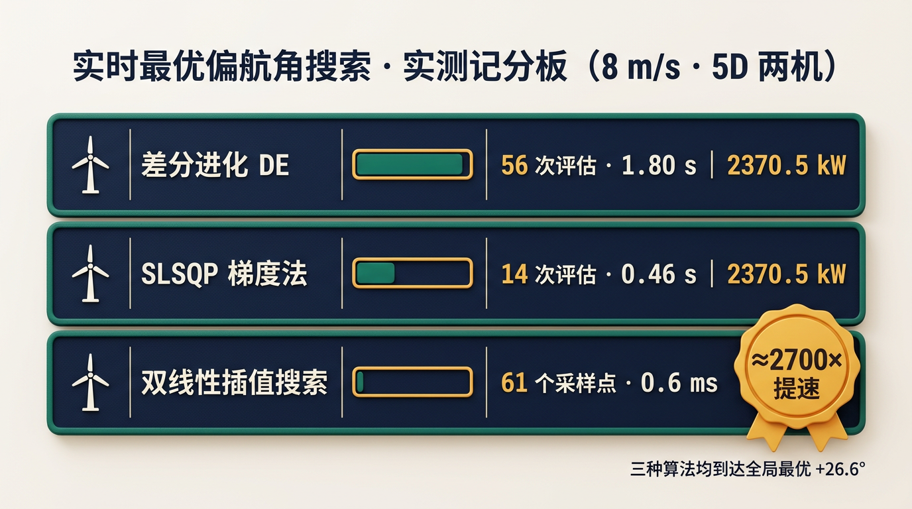

> **看图三秒：** 三条赛道 DE / SLSQP / 插值——只有第三条的进度条几乎为空：它最快。这就是本讲的反直觉点。

**本讲赌注：** 「最优角」不是被「最强」算法搜出来的，是被「最便宜」的找出来的。

---

#### 1. 生活与物理直觉引子：全城找最优面馆（致敬 Mr.GUO 白皮书的面馆比喻）

你接到任务：30 天内找到「最优偏航角」——全城（−30°~+30°）功率最高的那家「角度面馆」。

- **策略 A · 纯探索**：每家（13 个 5° 网格点）都亲自去吃一遍——网页不允许：滑块一动就得回答，等不起 339 s；
- **策略 B · 梯度下山**：站在某家尝一口，「往最香的方向挪一小步」——但功率曲线不是处处光滑，也没有解析导数；
- **策略 C · 聪明折中**：先拿一张「口味地图」（插值曲面）找峰值附近，再验证。

| 面馆元素 | 优化元素 |
| :--- | :--- |
| 每家面馆 | 候选偏航角 |
| 美味评分 | 全场功率 Ptot(γ) |
| 口味地图 | 双线性插值曲面 |
| 往最香方向挪 | 梯度法 SLSQP |
| 逐家吃 | 差分进化 DE |

> **先猜后揭：** 评估次数少的是不是就快？
> 记分板说：SLSQP 只要 14 次评估，比 DE 的 56 次快；**但冠军不是它俩**，是「61 个采样点、0.6 ms」的插值——因为它**根本不做优化，只做查表**。

---

#### 2. 工程死穴：solver 页的实时约束

`solver.html` 的需求［README］：**任意风速（6~12 m/s）输入，实时给出「最优偏航角 + 峰值功率」**，且断网可运行。

- FLORIS 是 Python 进程，进不了浏览器；
- 13 点扫描可以预计算，但 13 点不够——连续最优 26.6° 不在网格上；
- 结论：**在浏览器里放一张「快曲面」，让搜索发生在曲面上** → 双线性插值 + 局部细搜（61 点 ≈0.6 ms）［AUDIT H］。

---

#### 3. 数学公式从 0 到 1：一条「坡」的三种走法

先用面馆的话说一遍：

> 单风向下的功率 Ptot(γ) 是一条「坡」（单峰函数）：0° 左侧一个坡、右侧一个坡，峰值在 20~30° 之间。**搜最优 = 找坡顶。**

##### 3B. 本讲符号卡

| 符号 | 人话 | 备注 |
| :--- | :--- | :--- |
| γ | 偏航角（决策变量） | 13 点网格 / 连续 |
| Ptot(γ) | 全场功率（目标函数） | 单峰（两机单风向） |
| (s,t) | 插值权重 | 小矩形内定位 |
| ≈ | 口径符号 | 提速比随机器变，必须带 ≈ |

##### 3C. 主路径只要两条式

**核心式 ① — 双线性插值（「口味地图」的数学）**
**〔式〕** f(x,y) = (1−s)(1−t)·f₀₀ + s(1−t)·f₁₀ + (1−s)t·f₀₁ + s·t·f₁₁
**回译：** 用 (偏航, 风速) 两个坐标在预计算数据表里定位一个小矩形，四角加权平均就是答案——**<0.5 ms，不算优化，只查表**［README interp.js］。

**核心式 ② — 增益**
**〔式〕** Gain(γ) = Ptot(γ)/Ptot(0) − 1
**回译：** 2370.5 / 2190.39 − 1 ≈ +8.2%（连续最优口径）。

> 【深潜｜可跳过】
>
> - **插值凭什么可信？** 13×4 网格点距 5°×2 m/s，功率曲面平滑（单峰），插值误差远小于「网格点差」——这正是 61 点细搜能与 DE 56 次评估到达同一全局最优的原因［AUDIT H］。
> - **SLSQP 与 DE 的差别：** SLSQP 是梯度法（快、吃光滑性），DE 是种群法（慢、不怕多峰）。本问题是单峰，所以两者殊途同归［AUDIT H］。
> - **≈ 的由来：** 提速比 700×/2700× 是特定硬件实测，跨机有差异，页面恒用「≈」表述［AUDIT H / P2 定谳］。

---

#### 4. 值班手册

```text
离线高保真     → 13 点网格扫描（秒级）或 SLSQP（0.46 s）
在线实时       → 插值曲面细搜（0.6 ms，浏览器内）
交叉验证       → 两条路互检：网格最优 25° vs 连续 26.6°，差 1.6° 属工程容差
问「插值在骗人吗」→ 越界自动拒答（6~12 m/s、±30° 可信域）——不回答就是诚信
```
**一句话记住：插值是「口味地图」，优化是「亲自去吃」——地图又快又便宜，吃又贵又可靠，两个都要。**

---

#### 5. 比分日

**先报胜负：** 三种算法到达**同一**全局最优 +26.6° / 2370.5 kW，插值快 ≈2700×［AUDIT H］。

| 算法 | 评估次数 | 耗时 | 到达最优 | 提速比 |
| :--- | :---: | :---: | :---: | :---: |
| 差分进化 DE | 56 次 | 1.77~1.80 s | 2370.5 kW（+26.6°） | 1× |
| SLSQP | 14 次 | 0.46~0.47 s | 2370.5 kW（+26.6°） | ≈3.9× |
| 双线性插值细搜 | 61 点 | ≈0.6 ms | ≈2370.5 kW | ≈2700×（对 DE）/ ≈700×（对 SLSQP） |

［AUDIT H；口径写在页面注记，可用 `site/benchmark_solver.py` 复跑］

**怎么读这张表（防「假快速」）：** 别看「谁快」，先看「**是否到同一处**」——三行最优一致，速度才有意义；若插值快但到别处，那是「假快速」（第六篇口诀墙收口）。

---

#### 6. 可信度

| 维度 | 打分 | 人话 |
| :--- | :---: | :--- |
| 机理 | 4 | 单峰 + 光滑，插值前提成立 |
| 实测 | 4 | benchmark 可复跑 |
| 跨机 | 3 | 提速比随硬件变，恒带 ≈ |
| 全局性 | 3 | 两机单风向；九机不是单峰结构（第 05 讲） |

**可以攻击的点：** ① 九机问题多局部最优，插值+局部搜索不再「全局保证」；② 13×4 网格偏粗，若功率曲面峰在网格点之间，插值峰有偏（61 点细搜缓解）；③ 单风向。
**承前：** 第 03 讲快算子 → **启后：** 第 05 讲——九台机时，「一条坡」变成「一片丘陵」。

**附：口袋卡（可打印）**
> **搜角三路径**
> DE 56 次 1.80 s ｜ SLSQP 14 次 0.46 s ｜ 插值 61 点 0.6 ms
> 都到 +26.6° / 2370.5 kW ｜ 提速 ≈2700×（≈ 是诚信）

---

#### 章末：30 秒复述 · 掌握门自测

**30 秒复述稿（可朗读）：** 单风向功率是一条坡：DE 1.80 s、SLSQP 0.46 s、插值 0.6 ms 都到坡顶 2370.5 kW（+26.6°）；网页用插值，提速 ≈2700×，越界拒答。反派「瞎搜」，破绽「到同一处才算赢」。

**自测（先做再对答案）：**

1. 网页凭什么 0.6 ms 给出最优角？它成立的两个前提是什么？
2. SLSQP 14 次评估比 DE 56 次快，为什么网页不用 SLSQP？
3. 「网格最优 25°」与「连续最优 26.6°」的区别？答辩该说哪个？

<details>
<summary>参考答案</summary>

1. 预计算曲面（build 时注入）+ 浏览器内查表细搜；前提：功率曲面平滑单峰 + 在可信域（6~12 m/s、±30°）内。
2. SLSQP 依赖 Python/scipy 运行时，浏览器里跑不了；插值是纯 JS 查表。
3. 25° 是 13 点网格最优，26.6° 是连续搜索（2370.5 kW）；答辩说「网格口径 25°，连续口径 26.6°」，两个都报才严谨。

</details>

**元数据：** 证据等级 A｜复算路径 `site/benchmark_solver.py`｜关联页 `solver.html`。

---

<a id="lec-05" name="lec-05"></a>
### 【第05讲】3×3 九机阶梯让利（反派：一刀切）

#### 本讲开场 90 秒

**上讲闪回（第 04 讲）：** 两台机，一条坡，+8.13%。现在：九台机。

**本讲反派：** 「一刀切」——直觉认为「要么全员转 30°，要么谁都不转」。

**只要带走 3 句口诀：**

1. **前排让利、中排借道、后排满发**：四阶梯 8095 → 9299 → 9935 → 10041 kW。
2. **20° 胜过 30°**：让利有平衡点（第二排 +432 kW，全场净赚 107 kW）。
3. **第三排比第二排快**：5.31 > 5.10 m/s，10D 自恢复。

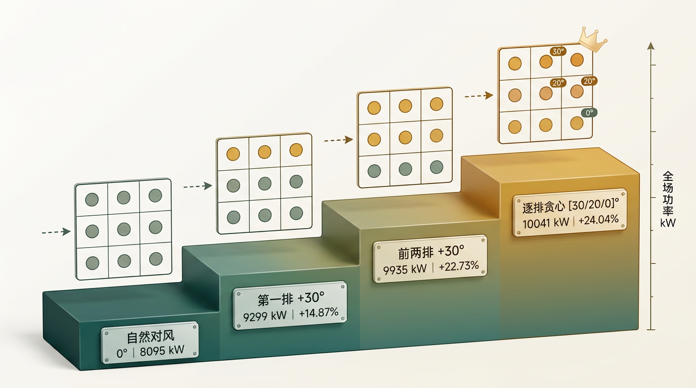

> **看图三秒：** 四级台阶 = 四个策略，台阶越高功率越高；最高一级三排徽章 [30°/20°/0°]——**最优解不是「都转」，而是「每排转各自的角」。**

**本讲赌注：** 本书王牌 +24.04%，在这里诞生。

---

#### 1. 生活与物理直觉引子：三车道高速公路

> **剧场：** 三车道公路，第一排车挡住第二排。
> - **一刀切**：所有车一起打方向让到路肩 → 前排掉速严重，全场流量不升反降；
> - **阶梯让道**：第一排先让（让利），第二排只让一点（借道，不过分），第三排不用让（道已通）→ 全场总流量最大。

| 公路元素 | 风电元素 |
| :--- | :--- |
| 第一排车 | Row 1（迎风首排） |
| 第二排车 | Row 2（被挡最狠） |
| 第三排车 | Row 3（离源最远、自恢复） |
| 让道幅度 | 偏航角 |
| 全场流量 | 全场功率 |

> **先猜后揭：** 第二排该转 20° 还是 30°？直觉：转多让多——**错**。20° 赢，答案在 §5 的账本。

---

#### 2. 工程死穴：九台的「分工」问题

- 九台全转 +30°：前排让利过大（单机 cos 损失 23.7%），后排本来干净、无需再让 → 全场功率反而低；
- 只转 Row 1：收益只有 +14.87%［README］；
- 问题：**每排转多少度，让全场总功率最大？**——这是 3 排 × 13 角的组合问题：穷举 13³ = 2197 种组合（本项目未做）；实际采用**逐排贪心**（Row 1→Row 2→Row 3 顺序决策，每排 13 候选）与**逐机贪心**（9×13）双通道取优［AUDIT 五］。

---

#### 3. 数学公式从 0 到 1：先看「排账本」，再谈策略

先用公路的话说一遍，再看自然对风（0°）的排账本：

| 排 | 单机功率 | 排均速 | 一句话 |
| :--- | :---: | :---: | :--- |
| Row 1 | 1754 kW | 7.97 m/s | 吃清洁风 |
| Row 2 | 437 kW | 5.10 m/s | 被 Row 1 尾流「贴脸」 |
| Row 3 | 508 kW | 5.31 m/s | 离源 10D，自恢复 |

［cases_array.csv / README / AUDIT C］

**两个反直觉观察：**
1. Row 2 最惨（437 kW）——被最近的风贼「贴脸」；
2. **Row 3（5.31）比 Row 2（5.10）还快**——第 01 讲的卷吸自恢复，10D 距离生效。

##### 3B. 本讲符号卡

| 符号 | 人话 | 备注 |
| :--- | :--- | :--- |
| [γ₁, γ₂, γ₃] | 三排偏航角向量 | 推荐解 [30, 20, 0]° |
| 行和 | 一排三台功率之和 | 审计逐机行和复算 |
| 双通道 | 逐机贪心 9×13 + 逐排贪心 3×13 | 取优 = 157 次/条件 |

##### 3C. 主路径只要两条式

**核心式 ① — 行和与全场**
**〔式〕** Ptot = Σ(行和)，Gain = Ptot/Pbase − 1
**回译：** 全场功率 = 三排行和相加；增益 = 相对 0° 基线 8095.15 kW 的百分比。

**核心式 ② — 让利与找补的权衡（Row 2 的 20° vs 30°）**
**〔式〕** ΔP = [P2(20°) − P2(30°)] + [P3(Row2=20°) − P3(Row2=30°)] = +432 − 334 ≈ +107 kW
**回译：** Row 2 少转 10° → 自己余弦损失变小（+432 kW），Row 3 的「流道」略窄（−334 kW），**净赚 +107 kW**——让利有平衡点，不是越多越好［口袋金句手卡 / AUDIT 五、六］。

> 【深潜｜可跳过】
>
> **行和明细（审计口径）：**
>
> | 策略 | Row 1 | Row 2 | Row 3 | 全场 |
> | :--- | :---: | :---: | :---: | :---: |
> | 不偏航 | 5262 | 1310 | 1523 | 8095 kW |
> | Row 1 +30° | 4020 | 3132 | 2148 | 9299 kW |
> | 前两排 +30° | 4020 | ≈2346（766~798 kW/台） | ≈3569（1171~1195 kW/台） | 9935 kW |
> | 贪心 [30,20,0] | 4020 | 2787 | 3235 | 10041 kW |
>
> 为什么「Row 2 转 30°」时 Row 3 行和反而更高（≈3569 > 3235）？Row 2 转 30°「彻底让开」Row 3，Row 3 单机飙到 1171~1195 kW；Row 2 转 20°「让得不够彻底」，Row 3 回落到 ≈1078 kW/台——但 Row 2 自己「赚回」441 kW，总和更高。**最优解是「交换」，不是「最大化某一行」。**［AUDIT 五、六］

---

#### 4. 值班手册

```text
问「为什么不全员 30°」→ 前排 cos 损失 23.7%，后排已干净无利可让，总和反降
问「Row 2 为什么 20°」→ 让利平衡点：自己 +432、后排 −334、净赚 +107
问「Row 3 为什么比 Row 2 快」→ 10D 卷吸自恢复（5.31 vs 5.10）
问「贪心是最优吗」→ 不是，是局部下限；全局 13³ 未搜（第六篇软肋②）
```
**一句话记住：前排让利、中排借道、后排满发——每排干每排的活，全场才赚。**

---

#### 5. 比分日

**先报胜负：** 四阶梯 8095.15 → 10041.46 kW，**+24.04%**［HANDOFF 可信数字］。

| 阶 | 策略 | 全场功率 | 增益 | 行和（kW） |
| :--- | :--- | :---: | :---: | :--- |
| 0 | 自然 0° | 8095.15 | — | 5262/1310/1523 |
| 1 | Row 1 +30° | 9299.05 | +14.87% | 4020/3132/2148 |
| 2 | 前两排 +30° | 9934.99 | +22.73% | 4020/≈2346/≈3569 |
| 3 | 贪心 [30,20,0]° | 10041.46 | **+24.04%** | 4020/2787/3235 |

**怎么读这张表（答辩「王牌页」）：**
- 先看「增量」：**+1204 → +636 → +107**——每一步增量递减，这是让利策略的边际递减规律；
- 阶 1→2：Row 2「自损」（3132→≈2346）换 Row 3「飙升」（2148→≈3569），净赚 +636 kW；
- 阶 2→3：Row 2「赚回」441（≈2346→2787），Row 3「吐回」334（≈3569→3235），净赚 +107 kW——**最优解是「交换」，不是「最大化」**。

**物理因果对照（组会高频质询）：** 前两排接力 +30° 时 Row 3 的 1171~1195 kW/台，比「不偏航」的 508 kW/台高出 130%+——因为 Row 2 彻底移开了对 Row 3 的覆盖［AUDIT 五］。

---

#### 6. 可信度

| 维度 | 打分 | 人话 |
| :--- | :---: | :--- |
| 策略 | 4 | 逐排贪心清晰可解释 |
| 数据 | 5 | 双语言复算一致（Python/Node） |
| 全局性 | 2 | 局部下限；「逐机 ⊃ 逐排」假设被实测推翻（10041.21 < 10041.46） |
| 泛化 | 3 | 270°/8 m/s 口径；其他风向见第 06 讲 |

**可以攻击的点：** ① 贪心无全局保证——本项目最有价值的「负结果」：曾假设「逐机自由度 ⊃ 逐排 ⇒ 逐机必更优」，实测 270°/8 m/s 逐机 10041.21 < 逐排 10041.46 kW，推翻后改**双通道取优**［AUDIT 五 教训］；② 行和舍入 ≤0.2 pct 差异属同源不同舍入路径［AUDIT 六］；③ 稳态单风向。
**承前：** 第 04 讲单峰搜索 → **启后：** 第 06 讲——风向一变，270° 的「主瓣」会消失，+24% 还剩多少？

**附：口袋卡（可打印）**
> **四阶梯（8 m/s · 270°）**
> 8095 → 9299（+14.87%）→ 9935（+22.73%）→ 10041（+24.04%）
> 20° 胜 30°：自己 +432、净赚 +107 ｜ 5.31 > 5.10：自恢复
> 一行：前排让利、中排借道、后排满发。

---

#### 章末：30 秒复述 · 掌握门自测

**30 秒复述稿（可朗读）：** 九台机不是「都转」，是「分工」：8095 → 9299 → 9935 → 10041 kW，四阶梯 +24.04%；Row 2 转 20° 不是 30°，因为让利有平衡点（+432/−334/+107）；第三排比第二排快，因为 10D 自恢复。反派「一刀切」，破绽「贪心只是下限」。

**自测（先做再对答案）：**

1. 四阶梯的增量「+1204 → +636 → +107」为什么递减？
2. Row 2 的 20° vs 30°，写出两排的「交换账」。
3. 「贪心 = 局部下限」是什么意思？哪个实测推翻了错误假设？

<details>
<summary>参考答案</summary>

1. 边际递减：前排让利后，后排可「找补」的空间越来越小（Row 3 已接近自恢复水平）。
2. Row 2：20° 比 30° 多发 432 kW；Row 3：因 Row 2 让得略少，少发 334 kW；净 +107 kW。
3. 贪心只在「已搜组合」里最优，不是全 13³ 组合的全局最优；推翻假设的实测：逐机贪心 10041.21 < 逐排贪心 10041.46 kW（270°/8 m/s）［AUDIT 五］。

</details>

**元数据：** 证据等级 A｜复算路径 `generate_array_windrose.py` / `array_independent_result.json`｜关联页 `array.html` `heatmap.html`。

---

<a id="lec-06" name="lec-06"></a>
### 【第06讲】风玫瑰与 AEP：别拿一个风向说全年（反派：单风向）

#### 本讲开场 90 秒

**上讲闪回（第 05 讲）：** 270° 风向，+24.04%。但风不会一年只吹 270°。

**本讲反派：** 「单风向」——拿一个风向的「最好时刻」下全年结论。

**只要带走 3 句口诀：**

1. **12 向 8 非零，几何全解释**：轴向 24%、列轴 21.6%、对角 10.7~11.3%。
2. **四个斜向 ≈0**：格点没有「对齐机位」，无人可让。
3. **等权 ΔAEP +8.86%**：12 向平均后的「年度口径」［AUDIT 五］。

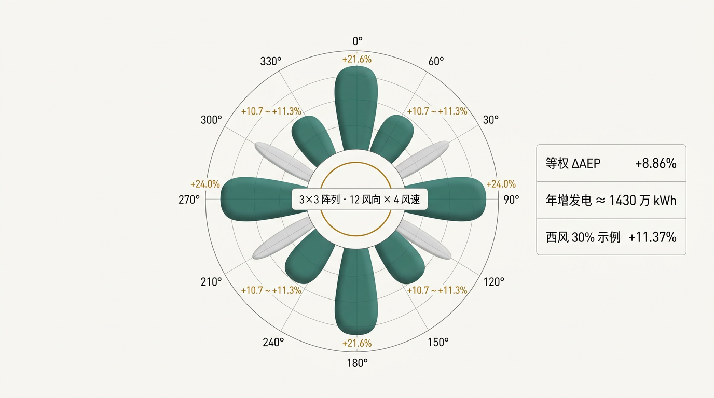

> **看图三秒：** 8 片绿花瓣 = 有增益的风向；4 片灰花瓣 = 零增益；右侧数据卡 = 年度口径三行。

**本讲赌注：** 单风向 +24% 是「单科高分」，ΔAEP +8.86% 才是「全年平均」——答辩该说平均分。

---

#### 1. 生活与物理直觉引子：太阳能板的朝向

> **剧场：** 太阳能板只有正午垂直于阳光时功率最大，早晚都打折——一天的发电量要对全天积分。风向同理：5D 排轴只在 90°/270°「正对」风；3D 列轴在 0°/180° 正对；对角风向与网格斜交（斜距 √(5²+3²)D ≈ 5.83D）。

| 太阳能元素 | 风电元素 |
| :--- | :--- |
| 正午垂直 | 90°/270°（排轴对风） |
| 早晚斜射 | 对角风向（≈45° 斜交） |
| 无收益方向 | 四个斜向（≈0 增益） |
| 日发电量 | AEP（年发电量） |

> **先猜后揭：** 哪个方向增益最大？直觉说「斜 45° 应该也不错」——
> 实测**完全相反**：轴向最大（24%）、对角一半（10.7~11.3%）、四个斜向为零。原因：只有风向「对齐」格点，才存在「前排-后排」这对可让利的角色。

---

#### 2. 工程死穴：16 向编造表的一课

审计前的风玫瑰页曾有一张「16 向表」：**E/W = 18.5% 对称复制、+5.6% AEP、850 万 kWh、340 万、7000 吨碳减排**——全部无出处；且「对称复制」（E 与 W 完全相等）在物理上过于干净［AUDIT G］。

审计后用**真实扫描**重做：12 风向 × 4 风速，数字全部出自 7536 次求解［AUDIT G/五］。

**本讲死穴：** 风玫瑰是全站「最漂亮」的图，也是「最容易被编」的图——16 片花瓣显得满，12 片显得诚实；复制的数字显得干净，实测的数字有噪声（90° 与 270° 的 base 差 0.83 kW）。

---

#### 3. 数学公式从 0 到 1：等权 ΔAEP 的口径

##### 3B. 本讲符号卡

| 符号 | 人话 | 备注 |
| :--- | :--- | :--- |
| w | 条件（风向 × 风速） | 12 × 4 = 48 条件 |
| ΔAEP% | 等权功率加权增益 | 简化口径，见 §6 |
| 非零扇区 | 增益 ≥1% 的风向 | 8 个 |

##### 3C. 主路径只要两条式

**核心式 ① — 等权 ΔAEP 口径**
**〔式〕** ΔAEP% = (Σ_w P_opt(w) − Σ_w P_base(w)) / Σ_w P_base(w)，w = 12 向 × 4 速（48 条件等权）
**回译：** 每个风向「等权」（不按真实风频加权——这是**简化口径**，见 §6），风速的权重隐含在功率值里（功率加权口径）［AUDIT 五：「等权功率加权」］。

**核心式 ② — 8 个非零扇区的几何解释**
- 90°/270°：沿 5D 排轴，对齐机距 5D → **+24.05%/+24.04%**；
- 0°/180°：沿 3D 列轴，3D 更近、干涉更重但可让空间更大 → **+21.60%**；
- 60°/120°/240°/300°：沿晶格对角，斜距 √(5²+3²)D ≈ 5.83D，对齐角差约 1° → **+10.74~+11.32%**；
- 30°/150°/210°/330°：无对齐机位 → **≈0**（原始扫描恰为 0.00%［AUDIT G：cases_windrose.csv 证实］）。

> 【深潜｜可跳过】
>
> - **镜像对称核查：** 90° base = 8095.98 kW vs 270° base = 8095.15 kW，差 0.83 kW（0.01%）——坐标旋转浮点噪声，非物理效应；页面以 90° 为头条（24.05%）并卡注镜像并列［AUDIT 五］。
> - **双通道：** 每条件 157 次（逐机 9×13 + 逐排 3×13），48 条件 = 7536 次 / 339 s；内置自检锚定独立交付值 10041.46 kW［AUDIT 五］。

---

#### 4. 值班手册

```text
问「一年赚多少」→ 等权 ΔAEP +8.86%（≈1430.1 万 kWh/年）；西风 30% 示例 +11.37%（1724 万 kWh）
问「斜向为什么 0」→ 格点无对齐机位：没有「前排-后排」，无人可让
问「等权公平吗」→ 是简化口径（未按风频加权）；按真实风玫瑰加权会给出不同数字（软肋）
问「为什么 12 向不是 16」→ 30° 步长口径；16 向插值无物理依据（审计 G 的教训）
```
**一句话记住：风玫瑰是让利策略的「年报」——单风向 +24% 是亮点，12 向 +8.86% 是事实。**

---

#### 5. 比分日

**先报胜负：** 3×3 阵列 12 向扫描完成，8 扇区非零，等权 ΔAEP **+8.86%**（年增 ≈1430.1 万 kWh）；西风 30% 示例 +11.37%（1724 万 kWh）［AUDIT 五］。

| 风向 | 对齐关系 | 增益（8 m/s） |
| :--- | :--- | :---: |
| 90°/270° | 5D 排轴 | +24.05% / +24.04% |
| 0°/180° | 3D 列轴 | +21.60% |
| 60°/120°/240°/300° | 晶格对角 ≈5.83D | +10.74~11.32% |
| 30°/150°/210°/330° | 无对齐 | ≈0（0.00%） |

**两台串列风玫瑰对照（重要！）：** 同口径下，两台串列**仅 270° 正对扇区有收益**（四个风速 11.41/8.13/6.79/9.37%），等权 ΔAEP 仅 **+0.51%**（年增 23.1 万 kWh）；西风 30% 示例 +1.97%（83 万 kWh）［AUDIT G］。

**怎么读这个对照：** 两机「只有风向恰好对齐才有收益」，九机「8 个方向都有收益」——**阵列冗余是风玫瑰的「分散投资」**；同时提醒：说「+8.13%」（两机单风向）与「+8.86%」（阵列等权）时，口径完全不同，**不可混用**。

---

#### 6. 可信度

| 维度 | 打分 | 人话 |
| :--- | :---: | :--- |
| 口径 | 4 | 48 条件等权，公式显式 |
| 数据 | 5 | 双语言一致 + 自检锚点 |
| 真实性 | 2 | 等权 ≠ 真实风频；未做风频加权［软肋⑥］ |
| 策略 | 3 | 仍是贪心下限（第 05 讲继承） |

**可以攻击的点：** ① 「等权」是最大口径问题——真实风电场 AEP 应按风向/风速联合概率（如 Weibull）加权；本项目显式声明「未加权」，它是**简化口径**而非「实测年发电量」；② 贪心下限传递到风玫瑰。
**承前：** 第 05 讲单风向王牌 → **启后：** 第三篇——流场数据那么大，怎么装进网页？

**附：口袋卡（可打印）**
> **风玫瑰年报（3×3）**
> 8 非零：轴向 24% · 列轴 21.6% · 对角 10.7~11.3% ｜ 四斜向 0
> ΔAEP +8.86%（等权）≈ 1430.1 万 kWh/年 ｜ 西风 30% +11.37%
> 两机仅 +0.51%：阵列冗余 = 分散投资。

---

#### 章末：30 秒复述 · 掌握门自测

**30 秒复述稿（可朗读）：** 风玫瑰是年报：12 向 8 非零（几何对齐解释），四斜向 0；阵列 ΔAEP +8.86%（等权、≈1430.1 万 kWh/年），两机仅 +0.51%——口径不同不可混用。反派「单风向」，破绽「年报要按 48 条件算」。

**自测（先做再对答案）：**

1. 四个斜向增益 ≈0 的几何原因是什么？
2. 「等权」口径指什么？它最大的局限是什么？
3. 两机风玫瑰 +0.51% 与阵列 +8.86% 的对比说明了什么？

<details>
<summary>参考答案</summary>

1. 格点（5D×3D）在这些方向上没有「对齐」的前后机位，不存在可让利的「前排-后排」结构。
2. 12 向 × 4 速共 48 条件各占等权，增益 = ΣP_opt/ΣP_base − 1；局限：未按真实风频（风向/风速联合概率）加权，是简化口径。
3. 两机收益依赖「恰好对齐」，九机在 8 个方向都有收益——阵列冗余带来方向分散性。

</details>

**元数据：** 证据等级 A｜复算路径 `generate_array_windrose.py` / `cases_array_windrose.csv`｜关联页（历史）`windrose.html` 已下线、数据保留科研留档［HANDOFF］。

---
<a id="part-3" name="part-3"></a>
# 第三篇 【降阶与代理推理】

本篇覆盖**第 07、08 讲**。主线问题：**流场太大（8192 个数）、网页太小（26 KB），中间怎么跨过去？** 两个答案：POD 负责「压缩」（07），插值代理负责「查表」（08）。

<a id="bridge-c" name="bridge-c"></a>
### 过桥 C · 从优化到降阶：数据变重了，网页不能变重

第二篇结束时，你手里有一堆「账本」：cases.csv、fields/*.npz、48 行风玫瑰——但要把流场「画」给评委看，数据必须进浏览器。
矛盾出现：**FLORIS 的流场切片是 64×128 网格（8192 个数/片）×13 偏航角 × 多个风速，而静态站零后端、断网可用。**

| 你将依次遇见 | 它专治的病 |
| :--- | :--- |
| 第 07 讲 POD | 「流场全存，网页变砖」 |
| 第 08 讲 代理推理 | 「每次现场算，断网就死」 |

**阅读纪律（本篇通用）：**

1. 先分清「证明」与「上线」：POD 在本项目首先是**流场低复杂度的证明**，代理插值才是**上线的推理通道**；
2. 每个数字带可信域（6~12 m/s、±30°）；
3. 深潜框可跳；章末自测不过关就回心智图。

下一页反派登场，它的名字叫**全存**。

---

<a id="lec-07" name="lec-07"></a>
### 【第07讲】POD：把 8192 维流场压成两笔（反派：全存）

#### 本讲开场 90 秒

**上讲闪回（第 06 讲）：** 风玫瑰算完，下一步是把流场「搬上」网页。

**本讲反派：** 「全存」——直觉认为「流场要展示，就得把 8192 个数全存下来」。

**只要带走 3 句口诀：**

1. **SVD = 找两笔最重要的「笔画」**：按能量排序，前两笔就够。
2. **模态 0 推走（76.4%）、模态 1 补回（21.6%）**：尾流的两个动词。
3. **2 模态 = 97.97%**：剩下 8190 维只占 2%［README / AUDIT A］。

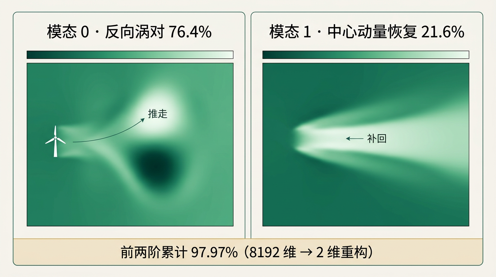

> **看图三秒：** 左联深绿浅绿「被推歪」= 模态 0；右联中心变浅 = 模态 1「补回」。尾流的物理，全在这两个动词里。

**本讲赌注：** 97.97% 不只是数字，它是「尾流是低复杂度系统」的**物理证明**——代理模型可行的前提。

---

#### 1. 生活与物理直觉引子：用两个词描述一张脸

> **剧场：** 向陌生人描述你的好朋友，你不会列 8192 个面部坐标——你会说「圆脸 + 单眼皮」，对方脑海里已经有了 90% 的形象。
> POD 就是这件事的数学化：把任意流场分解成一组「正交基本图案」（模态），按能量排序，取前几个，流场就能重构。

| 描述元素 | POD 元素 |
| :--- | :--- |
| 8192 个面部坐标 | 64×128 流场网格（8192 维） |
| 两个词「圆脸+单眼皮」 | 模态 0 + 模态 1 |
| 像了 90% | 能量占比 97.97% |
| 说不清的细节 | 剩余模态（≈2%） |

> **先猜后揭：** 模态 0 是「推走」还是「补回」？
> 揭晓：**推走**——反对称偶极子（CVP）能量最大（76.38%），它正是第 02 讲「把尾流推歪」的那个物理动作的「模态画像」［AUDIT A：模态 0 订正为反对称偶极子］。

---

#### 2. 工程死穴：网页的「数据重量」问题

- 13 偏航角 × 8192 数 × 浮点 ≈ 每偏航角数百 KB 量级（实际以 npz 切片存留档）；
- 网页零后端，数据必须「注入」JS 文件，离线包要小；
- 若「全存」：首屏重、断网包大、维护面广；
- POD 证明流场的「模式」可以 2 个系数重构——**网页只需要「查哪两个笔画、各占多少」**。

**定位声明（诚实边界）：** 现役 `pod.html` 的作用是**展示 POD 分解结果（3 张 Nature 图同排）+ 证明流场可压缩性**；现役网页的流场渲染走的是「关键切片注入 + 插值」通道（`data_3d.js`，5 偏航 × 9 高度层），**POD 系数尚未接进在线重构控制回路**［README 页面表 / HANDOFF］。

---

#### 3. 数学公式从 0 到 1：矩阵的「两笔」

先用脸的话说一遍：把 8192 维流场摊成 64 行 × 128 列的矩阵，SVD 把它「摊平」成一组正交笔画。

##### 3B. 本讲符号卡

| 符号 | 人话 | 备注 |
| :--- | :--- | :--- |
| U (64×128) | 流场矩阵 | 一个偏航角的速度场切片 |
| σᵢ | 第 i 笔的「粗细」 | σ₁ ≥ σ₂ ≥ … |
| φᵢ | 第 i 笔的「形状」 | 空间模态 |
| Eᵢ = σᵢ²/Σσ² | 第 i 笔的能量占比 | 模态 0 76.38% |

##### 3C. 主路径只要两条式

**核心式 ① — SVD 分解**
**〔式〕** U = Σᵢ σᵢ · φᵢ · ψᵀ（σ₁ ≥ σ₂ ≥ … ≥ σₙ）
**回译：** 每个 σᵢ 对应一个「图案」（空间形状 φᵢ × 强度 ψᵢ）；σ 越大，这个图案越「重要」。

**核心式 ② — 能量占比**
**〔式〕** Eᵢ = σᵢ² / Σⱼ σⱼ²
**回译：** 「那一笔占多少能量」。模态 0 76.38%，模态 1 21.58%，前两阶累计 **97.97%**［README / HANDOFF 可信数字］。

> 【深潜｜可跳过】
>
> - **为什么能量是 σ² 不是 σ？** 流场总能量 = 所有网格点速度（平方）之和；SVD 的正交性保证每个模态的能量贡献恰好 = σᵢ²。
> - **模态 0 的物理身份：** 反对称——上半区均值 +0.0058、下半区均值 −0.0056（上下反对称），即**反向旋转涡对（CVP）**把尾流推偏（与第 02 讲「推走」同一物理源头）［AUDIT A：独立 SVD 重算订正］。
> - **一段事故史：** 网页曾写「82.4/15.7/累计 98.1%」——与自家配图标题（76.4/21.6）互相矛盾；审计独立重算 SVD 后订正，模态 0 身份一并订正为反对称偶极子［AUDIT A］。**本讲的数字值得被强调：它们是「打」出来的。**

---

#### 4. 值班手册

```text
问「POD 是什么」→ 流场矩阵的奇异值分解：模态按能量排序，前几个重构流场
问「凭什么 2 个模态够」→ 97.97%，剩余 2% 是流场的「细噪」
问「两个模态是什么」→ 模态 0 反向涡对「推走」（76.4%）；模态 1 中心动量「补回」（21.6%）
问「用在哪」→ pod.html 展示 + 「流场低复杂度」证明（代理模型可行的前提）
```
**一句话记住：8192 个数 → 2 个数，尾流不是「乱」的，是「有规律的舞」。**

---

#### 5. 比分日

**先报胜负：** 前两阶累计 **97.97%**，独立 SVD 重算与图一致［AUDIT A］。

| 模态 | 能量占比 | 物理身份 |
| :--- | :---: | :--- |
| 模态 0 | 76.38% | 反对称反向涡对（CVP）「推走」 |
| 模态 1 | 21.58% | 中心动量「补回」（卷吸恢复） |
| 前两阶累计 | 97.97% | 流场可重构 |
| 其余 | 2.03% | 高阶细节 |

**怎么读这张表：** 「身份」列比「数字」列更重要——前两模态有清晰物理身份（推/补），这正是 POD「可解释」而非「黑箱压缩」的原因。

---

#### 6. 可信度

| 维度 | 打分 | 人话 |
| :--- | :---: | :--- |
| 方法 | 5 | SVD 成熟数学工具 |
| 数据 | 5 | 独立重算 |
| 范围 | 3 | 单截面（64×128）、单工况稳态；时程/三维未覆盖［软肋④］ |
| 应用 | 3 | 本项目是「展示 + 证明」，非在线降阶控制器 |

**可以攻击的点：** ① 单快照而非时变（真时变 POD 需要快照序列）；② 单工况（8 m/s 270°），其他工况模态能量占比需重算；③ POD 系数未接入控制回路（申请书的 PINN 路线是待办，C 级）。
**承前：** 第 02 讲 CVP「推走」获得了模态画像 → **启后：** 第 08 讲——除了「压缩」，还有一条更便宜的「查表」路。

**附：口袋卡（可打印）**
> **POD 两笔**
> 模态 0 推走 76.38%（CVP 偶极子）｜ 模态 1 补回 21.58%（中心恢复）
> 前两阶累计 97.97% ｜ 8192 维 → 2 维
> 旧错值 82.4/15.7/98.1 已订正［AUDIT A］——数字是打出来的。

---

#### 章末：30 秒复述 · 掌握门自测

**30 秒复述稿（可朗读）：** POD = 流场矩阵 SVD，模态按能量排序：模态 0 反向涡对「推走」76.38%，模态 1 中心动量「补回」21.58%，前两阶 97.97%；它证明尾流低复杂度、代理可行；旧错值 82.4 被审计订正。反派「全存」，破绽「两笔就够」。

**自测（先做再对答案）：**

1. 写出能量占比式子，并解释为什么是 σ² 而不是 σ。
2. 两个模态的物理身份？与第 02 讲的「推走/补回」怎么对应？
3. 「97.97%」证明了什么？它不能证明什么？

<details>
<summary>参考答案</summary>

1. Eᵢ = σᵢ²/Σσⱼ²；总能量是速度平方和，正交分解下每模态贡献 σᵢ²。
2. 模态 0 = CVP 偶极子「推走」（反对称），模态 1 = 中心动量「补回」（卷吸恢复）；与第 02 讲 CVP 偏转、第 01 讲自恢复一一对应。
3. 证明了「该工况流场是低复杂度的、可 2 模态重构」；不能证明「所有工况都 97.97%」，也不能证明「时变尾流也低复杂度」。

</details>

**元数据：** 证据等级 A（独立 SVD 重算）｜复算路径 `pod_analysis.py` / `pod_results/`｜关联页 `pod.html`。

---

<a id="lec-08" name="lec-08"></a>
### 【第08讲】代理模型与端侧推理：在浏览器里解流场（反派：贵如登月）

#### 本讲开场 90 秒

**上讲闪回（第 07 讲）：** POD 证明流场「可压缩」；但网页真正的诉求是「滑块一动，立刻有功率」。

**本讲反派：** 「贵如登月」——直觉认为「跑流场要服务器、要 GPU、要 API」。

**只要带走 3 句口诀：**

1. **数据在 build 时注入，运行时只查表 + 插值**：服务器是「夜班工人」。
2. **26 KB + <0.5 ms**：整个流场数据库比一张网页还小［AUDIT 六 / 口袋卡］。
3. **可信域是生命线**：6~12 m/s、±30°，越界自动提示，绝不硬答［README］。

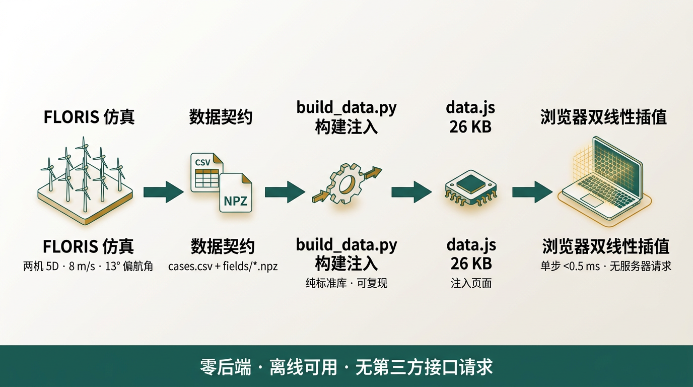

> **看图三秒：** FLORIS → CSV/NPZ → build_data.py → data.js → 浏览器插值 <0.5 ms；底栏「零后端 · 离线可用 · 无第三方请求」。

**本讲赌注：** 「零后端」不是炫技，是**价值选择**——答辩断网备胎、审计可复现，都站在它头上。

---

#### 1. 生活与物理直觉引子：餐厅的预制酱汁

> **剧场：** 高档餐厅不会每单现熬汤——厨师提前熬好 20 种基础酱汁（FLORIS 预计算 13 偏航 × 4 风速），服务员（浏览器）只做「取 1/3 酱汁 A + 1/3 酱汁 B」（双线性插值），0.5 秒上桌。

| 餐厅元素 | 工程元素 |
| :--- | :--- |
| 基础酱汁 | 预计算切片（13×4 网格） |
| 1/3 A + 1/3 B | 双线性插值 |
| 服务员 | 浏览器 interp.js |
| 后厨打烊 | 零后端 |
| 菜单外不做 | 可信域越界提示 |

> **先猜后揭：** 插值的误差是「模型误差」吗？
> 揭晓：**不是**——插值没有「模型误差」，只有「网格粗细」（第 04 讲的前提）。`model.html` 页面上的 XGBoost 才是「模型」，而它的证据**只有图源级**（下文诚实声明）。

---

#### 2. 工程死穴：答辩的「断网」

答辩现场、组会现场、展厅：**网络可能断、服务器可能不在、GPU 可能是奢侈品。**
团队的选择：把数据「印」进网页（data.js），浏览器就是计算机：

- `site/build_data.py`（**纯标准库**）把 CSV/JSON 注入 JS［README］；
- 浏览器 `interp.js` 双线性插值 **<0.5 ms**［口袋卡］；
- Plotly.js / three.js 全部本地离线依赖，运行时**不请求任何第三方接口**［HANDOFF 五］。

**这就是「离线可用」的由来——也是审计能做「位级复现」的原因**：网页里的数字与源数据是同一份文件。

---

#### 3. 数学公式从 0 到 1：契约即接口法

##### 3B. 本讲符号卡

| 符号 | 人话 | 备注 |
| :--- | :--- | :--- |
| predict_power | AI 组契约函数 | 输入 2 数，输出 4 字段 |
| outOfRange / reasons | 两个「诚信字段」 | 越界 = 不回答 |
| s, t | 插值权重 | 小矩形定位 |

##### 3C. 主路径只要两条式

**核心式 ① — 功率契约**
**〔式〕** predict_power(yaw, U) → { p1, p2, ptot, outOfRange, reasons }
**回译：** 输入两个数（偏航、风速），输出两机功率 + **两个诚信字段**：outOfRange（是否越界）与 reasons（为什么）——**API 本身把「诚实」写进了接口**［README 数据契约］。

**核心式 ② — 插值（呼应第 04 讲）**
**〔式〕** f(yaw, U) = (yaw, U) 所在小矩形四角按 s,t 加权
**回译：** 13×4 网格上任意一点都能「定位 + 加权」，单步 <0.5 ms［口袋卡］。

> 【深潜｜可跳过】
>
> - **数据为什么只有 26 KB？** 注入的是「功率表 + 关键切片 + 风玫瑰 48 行」，不是全部 8192 维切片；3D 页单独走 `data_3d.js`（5 偏航 × 9 高度层关键切片）［README / AUDIT 六］。流场 npz（64×128×13）是「留档资产」，网页取「关键视角」。
> - **XGBoost 的证据边界：** `model.html` 展示 XGBoost 交付图源，但**原始训练压缩包未纳入仓库，不承诺仓内完整重训**［README 数据口径 / AUDIT F］。这就是「边界诚实」——不能复现的模型，只配「图源级佐证」。
> - **留档工具偏差：** Streamlit 留档 `predict_power_2d` 曾用 cos^1.5 启发式（口径应为 FLORIS 原生 1.88），审计仅加注释不改行为（留档工具不影响站点 JS 口径）［AUDIT 六］。

---

#### 4. 值班手册（三组数据契约）

```text
仿真组：cases.csv / fields/*.npz → u(64,128) m/s（绝对风速，不归一化）
控制组：find_yaw_for_target(target, U) → (best_yaw, P, err%)
AI 组 ：predict_power(yaw, U) → {p1, p2, ptot, outOfRange, reasons}
字段形状不可变更［README 数据契约］
```
**一句话记住：契约是五人协作的「接口法」——你只需承诺形状，内部随便演化。**

---

#### 5. 比分日

**先报胜负：** 数据管道全链路纯标准库可复现，`build_data.py` 重复构建哈希不变［HANDOFF 审计结果］。

| 项 | 数值 | 来源 |
| :--- | :--- | :--- |
| data.js 体积 | 26,502 B（≈26.4 KB） | AUDIT 六 |
| 单步插值 | <0.5 ms | 口袋卡 |
| 可信域 | 6~12 m/s、±30° | README |
| 离线依赖 | Plotly / Three.js / Geist 本地 | HANDOFF |

**体感换算：** 「服务器」成本 = 0；「夜班」成本 = 跑一次 `build_data.py`。**网页每个数字想质疑，三步回到 CSV**（页面 → data.js → cases.csv）。

---

#### 6. 可信度

| 维度 | 打分 | 人话 |
| :--- | :---: | :--- |
| 架构 | 5 | 零后端、位级自洽 |
| 契约 | 4 | 字段显式、越界提示内建 |
| XGBoost | 2 | 图源级佐证，仓内不可重训［软肋⑤］ |
| 泛化 | 3 | 可信域边界清晰；域外「不答」不「猜」 |

**可以攻击的点：** ① XGBoost 不可复现（原始压缩包不在仓）；② 网格 13×4、线性插值（无曲率修正）；③ 「26 KB」是双机口径，九机流场切片走 `data_3d.js` 单独通道。
**承前：** 第 04 讲插值曲面 + 第 07 讲可压缩性 → **启后：** 第四篇——除了「每次搜最优角」，能不能让机器「学会」跟踪？

**附：口袋卡（可打印）**
> **端侧推理**
> build_data.py（纯标准库）→ data.js 26.4 KB → 浏览器 <0.5 ms
> 越界 = 不回答（outOfRange / reasons）｜ XGBoost = 图源级佐证，别夸

---

#### 章末：30 秒复述 · 掌握门自测

**30 秒复述稿（可朗读）：** 代理与端侧：数据 build 时注入（26.4 KB），浏览器只查表 + 双线性插值（<0.5 ms），可信域 6~12 m/s、±30°，越界自动拒答；XGBoost 只有图源级佐证。反派「贵如登月」，破绽「夜班工人一次，白天零成本」。

**自测（先做再对答案）：**

1. `predict_power` 输出的两个「诚信字段」是什么？它们的作用？
2. 网页凭什么「断网可用」？依赖哪三类本地文件？
3. XGBoost 为什么是「图源级佐证」？它与 FLORIS 数据的证据差别在哪？

<details>
<summary>参考答案</summary>

1. outOfRange（是否超出可信域）与 reasons（原因）；作用是把「不回答」写进 API，防止越界硬答。
2. 数据注入 data*.js（build 时）、离线依赖 Plotly/Three.js/Geist、纯 JS 推理无网络请求。
3. 原始训练压缩包不在仓库、无法仓内重训，只有交付图可看；FLORIS 数据有完整生成脚本可复算（A 级）。

</details>

**元数据：** 证据等级 A（管道）+ B/C（XGBoost 图源）｜复算路径 `site/build_data.py` + `site/check_contract.py`｜关联页 `model.html` `interface.html`。

---
<a id="part-4" name="part-4"></a>
# 第四篇 【强化学习 PPO】

本篇覆盖**第 09、10 讲**。主线问题：**电网每秒下发一次功率指令，不可能「每秒重新优化一次」——怎么办？**

<a id="bridge-d" name="bridge-d"></a>
### 过桥 D · 从「搜」到「学」：优化器每次「想」，RL 智能体每次「记得」

第三篇结束时，你能 <0.5 ms 回答「这个风速该转多少度」——但那是**无状态**的：它不知道「我现在转到哪了、目标每秒都在变」。
强化学习换了一个问法：

| 你将依次遇见 | 它专治的病 |
| :--- | :--- |
| 第 09 讲 PPO 闭环 | 「目标每秒变，优化器无状态」 |
| 第 10 讲 物理可达域 | 「目标设错，RL 永远不收敛」 |

**阅读纪律（本篇通用）：**

1. 先背契约（4 维观测、±5° 动作），再谈网络结构；
2. 每个指标带「seed 42 · 200 回合」口径，不夸成「多种子稳定」；
3. 深潜框可跳；章末自测不过关就回心智图。

下一页反派登场，它的名字叫**每次重算**。

---

<a id="lec-09" name="lec-09"></a>
### 【第09讲】为什么不每次重新优化：PPO 闭环（反派：每次重算）

#### 本讲开场 90 秒

**上讲闪回（第 08 讲）：** 插值曲面 0.6 ms 回答「该转多少度」。但电网的功率目标是「每秒一个新值」。

**本讲反派：** 「每次重算」——直觉认为「目标变一次，就重新优化一次」。

**只要带走 3 句口诀：**

1. **优化器「想」，RL 智能体「有肌肉记忆」**：目标变，策略不变。
2. **4 维观测契约**：[风速, 当前偏航, 当前功率, 目标功率]。
3. **±5°/step：转得慢，才保护齿轮箱**：平滑度写进动作域［交付契约］。

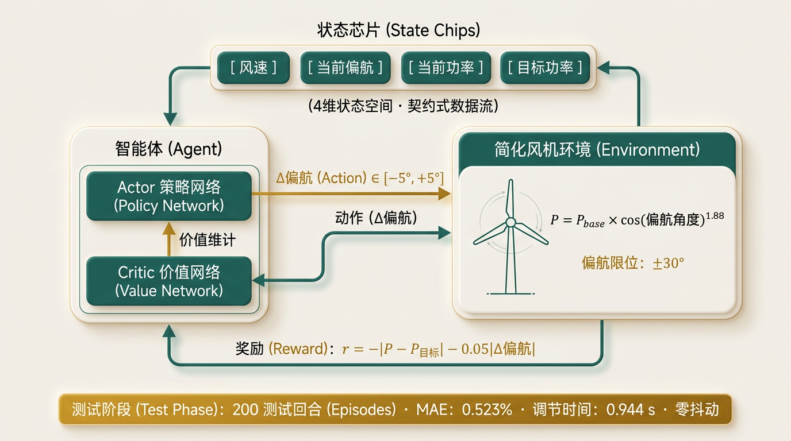

> **看图三秒：** 左侧 Agent（Actor 决定、Critic 评估），右侧环境（cos^1.88 物理定律），环形箭头 = 训练循环，底部琥珀条 = 考试成绩。

**本讲赌注：** RL 不是「更高级的优化器」，是「**预训练好的策略库**」。

---

#### 1. 生活与物理直觉引子：出租车司机 vs 导航

> **剧场：** 导航（优化器）：每次给目的地都「从头算路线」——准，但每次都要算，而且**没有记忆**；
> 出租车司机（RL 智能体）：开了十万公里，你说「去东门」，他的手已经在方向盘上了——**不用现算，经验在手里**。

| 出租车元素 | RL 元素 |
| :--- | :--- |
| 目的地 | 目标功率 P_target |
| 驾驶经验 | 策略网络 π（Actor） |
| 「还差多远」的直觉 | 价值网络 V（Critic） |
| 油耗 + 急刹惩罚 | 奖励 −\|err\| − 0.05\|Δyaw\| |
| 方向盘转角限制 | Δyaw ∈ [−5°, +5°]/step |

> **先猜后揭：** 为什么不训练时直接「一次转 30°」？
> 揭晓：物理上允许，但**偏航驱动（机械系统）不允许**——转动有转速限制、有磨损。±5°/step 就是「方向盘限制」，奖励里的 0.05·|a| 惩罚项也在劝它「轻一点」［simplified_turbine_env.py / 交付契约］。

---

#### 2. 工程死穴：电网的「秒级」需求

申请书第三条研究内容：**输入当前所需功率，系统实时输出并调整各风机偏航角**［申请书，C 级承诺］。
现场约束：

- 功率目标**连续**（每秒新值）；
- 偏航驱动**慢**（不能瞬间转 30°）；
- 求解器（哪怕 0.6 ms）**无状态**——它不知道「我现在转到哪了、还差多少」。

**优化器回答「该去哪」，RL 智能体回答「从现在的位置，一步步怎么走」——这就是「秒」的差别。**

---

#### 3. 数学公式从 0 到 1：小步更新的策略

先用出租车的话说一遍：PPO =「近端策略优化」——Actor 不断试、Critic 打分，每次更新**约束自己别偏离上次太远**（PPO 的「proximal/近端」核心）。

##### 3B. 本讲符号卡

| 符号 | 人话 | 备注 |
| :--- | :--- | :--- |
| s = [u∞, yaw, P, P_target] | 4 维观测契约 | 原包 3 维，复现补齐 |
| a = Δyaw | 单步动作 | ∈ [−5°, +5°] |
| r | 奖励 | −\|err\| − 0.05\|a\| |
| P_act | 环境实际功率 | P_base·cos^1.88(yaw) |
| π / V | 策略 / 价值网络 | 双 MLP(4→64→64) |

##### 3C. 主路径只要三条式

**核心式 ① — 状态与动作（契约）**
**〔式〕** s = [u∞, yaw_now, P_now, P_target]（4 维），a = Δyaw ∈ [−5°, +5°]
**回译：** 「4 维观测契约」——原交付包是 3 维（缺 power_current），2026-08-10 复现时补齐为 4 维［simplified_turbine_env.py 注释 / AUDIT 七］。

**核心式 ② — 奖励**
**〔式〕** r = −|P_act − P_target| − 0.05·|a|
**回译：** 越接近目标分越高；方向盘越轻分越高（动作惩罚保护偏航驱动）［交付契约 / simplified_turbine_env.py］。

**核心式 ③ — 物理定律（环境）**
**〔式〕** P_act = P_base · cos^1.88(yaw)，yaw ← clip(yaw + a, ±30°)
**回译：** 环境是「诚实的物理老师」——功率做不了假，余弦定律说了算［simplified_turbine_env.py］。

> 【深潜｜可跳过】
>
> **训练口径（ppo_repro_train.py 显式假设，全部「钉死」）：**
> 1. dt = 0.1 s/step，episode 200 步 = 20 s（env 无时间尺度，取偏航执行器常见量级）；
> 2. 目标域 target ∈ [0.78, 0.98] × P_base(u∞)，u∞ ~ U[6,12] m/s；
> 3. 奖励整体 ×0.01（正仿射变换，保 err:action 相对权重，仅稳定数值，不改变最优策略）；
> 4. 观测归一化 [u/10, yaw/30, p/5000, t/5000]——v1 教训：数千 kW 裸值灌进 tanh 导致饱和；
> 5. PPO 双 MLP(4→64→64)，高斯策略，动作截断 ±5°，seed=42；训练 600 迭代实跑收敛［AUDIT 七］。
>
> **P_base 公式：** P_base = 0.5·ρ·π·63²·C_P·u³/1000（C_P=0.45）；u=8 m/s → ≈1759.6 kW，与 FLORIS Row 1 的 1754 kW 相差 <0.4%——**两套「功率口径」咬合，这是 PPO 数字可信的前提**［simplified_turbine_env.py + cases.csv］。

---

#### 4. 值班手册

```text
问「为什么不用 0.6 ms 的优化器」→ 它无状态：答不了「从当前角度一步步怎么走」
问「为什么 ±5°」→ 偏航驱动转速 + 磨损（机械约束），奖励里也惩罚大动作
问「PPO 在训练什么」→ 策略网络：4 维状态 → 小步角；价值网络：「离目标多远」的直觉
问「训练了多少」→ 600 迭代实跑收敛（原 0B 占位由复现补齐，见第 12 讲）［AUDIT 七］
```
**一句话记住：优化器是「路线规划」，RL 是「司机」——目标变了，司机不变。**

---

#### 5. 比分日

**先报胜负：** PPO 闭环复现收敛，200 独立测试回合稳态 MAE **0.523%**（<1.2% 口径）［AUDIT 七 / model README］。
（「0B 占位」事件的完整戏剧，见第 12 讲。）

| 指标 | 数值 | 口径 |
| :--- | :---: | :--- |
| 稳态跟踪 MAE | 0.523%（10.31 kW） | <1.2%［交付口径］ |
| 平均调节时间 | 0.944 s（95 分位 1.805 s） | ~0.8 s 级［README 数据口径］ |
| 稳态动作抖动 | 0.0000 °/step | 零抖动 |
| 权重体积 | 55,420 B | seed 42 |

［AUDIT 七；metrics_repro.json / ppo_eval_traces.json，模型 SHA-256 已记录——图表必须读这些文件，禁止手工编造种子或轨迹］

---

#### 6. 可信度

| 维度 | 打分 | 人话 |
| :--- | :---: | :--- |
| 方法 | 4 | PPO 成熟算法 |
| 复现 | 4 | 600 迭代实跑 + 200 回合独立评测 + 双 JSON 锚点 |
| 泛化 | 2 | **仅 seed 42**，不声称多种子稳定性［README 红线］ |
| 范围 | 3 | 单机功率跟踪；多机协同（MADDPG）是待办［申请书 C 级］ |

**可以攻击的点：** ① 单种子；② 环境是 cos^1.88 简化模型（非完整 FLORIS 场）；③ 「平滑度提升 42%」是交付文档口径［B 级，未复算］；④ `power_tracking.html` 上部是浏览器双线性代理反向搜索、下部是 PPO 权重**离线评测**——**不得混写为「浏览器内 PPO 推理」**［HANDOFF 三］。
**承前：** 第 08 讲代理「知道功率」→ **启后：** 第 10 讲——PPO 为什么「目标设错就不收敛」？物理定律在看着。

**附：口袋卡（可打印）**
> **PPO 闭环**
> s = [风速, 当前偏航, 当前功率, 目标功率] ｜ a = Δyaw ∈ ±5°/step
> r = −|err| − 0.05|a| ｜ P = P_base·cos^1.88(yaw)
> 0.523% MAE · 0.944 s · 零抖动 ｜ 仅 seed 42，别夸

---

#### 章末：30 秒复述 · 掌握门自测

**30 秒复述稿（可朗读）：** PPO = 有记忆的司机：4 维观测（风速/当前偏航/当前功率/目标功率）、±5°/step 小步动作、奖励惩罚误差和大动作；200 回合 MAE 0.523%、调节 0.944 s、零抖动；只验证 seed 42。反派「每次重算」，破绽「策略是预训练的」。

**自测（先做再对答案）：**

1. 4 维观测契约是哪 4 维？原包 3 维差在哪、为什么是问题？
2. 奖励里 0.05·|a| 项的作用？
3. P_base(8 m/s) ≈ 1759.6 kW 与 FLORIS 1754 kW——这个 <0.4% 的差说明什么？

<details>
<summary>参考答案</summary>

1. [u∞, yaw_now, P_now, P_target]；原包缺 power_current（3 维），智能体「看不到当前功率」，跟踪回路不完整，复现时补齐为 4 维契约。
2. 动作惩罚：抑制大角度猛转，保护偏航驱动（齿轮箱），稳态零抖动的直接原因之一。
3. 两套独立实现（简化环境 vs FLORIS）的功率口径一致，PPO 的物理基础与仿真基础「咬合」，指标可比。

</details>

**元数据：** 证据等级 A（复现/评测）+ B（42% 平滑度）｜复算路径 `20260810洪/extracted/ppo_repro_train.py` + `ppo_repro_eval.py`｜关联页 `power_tracking.html`。

---

<a id="lec-10" name="lec-10"></a>
### 【第10讲】物理可达域：风机为什么转不出 50%（反派：追风）

#### 本讲开场 90 秒

**上讲闪回（第 09 讲）：** PPO 闭环看着很美——但它的第一版「不收敛」。

**本讲反派：** 「追风」——把训练目标设成满功率的 35%，系统永远在追一个**物理上够不着**的数。

**只要带走 3 句口诀：**

1. **cos^1.88(30°) = 76.31% 是地板**：偏航转满 30°，也只能降到 76.31%。
2. **目标低于地板 = 永远不收敛**：误差「结构性」不可达。
3. **[0.78, 0.98]×P_base 是唯一收敛域**：地板之上留 1.7 个点余量［ppo_repro_train.py］。

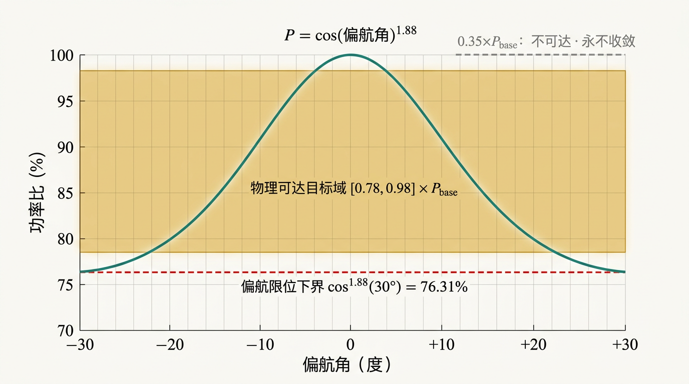

> **看图三秒：** 绿曲线在 ±30° 处落到 76.31%；琥珀带 [0.78, 0.98] 是「出题范围」；红虚线是地板；灰虚线 0.35 是「够不着的那道」。

**本讲赌注：** 强化学习的第一课不是网络，是**先问物理定律「你够得着多远」**。

---

#### 1. 生活与物理直觉引子：梯子

> **剧场：** 你想够到五楼，但梯子只有四级。你再努力、再聪明、再多加练一百遍——**也够不着**。
> 问题不在「攀爬技术」（算法/网络），在「梯子级数」（物理）。

| 梯子元素 | PPO 元素 |
| :--- | :--- |
| 梯子的四级 | 偏航 ±30° 可达下界 = 76.31% |
| 五楼的目标 | 目标 0.35×P_base |
| 攀爬技术 | 网络结构 / 超参数 |
| 第三级（留余量） | 下界取 0.78（比地板 0.7631 高 1.7 个点） |

> **先猜后揭：** 目标设 0.70×P_base 能收敛吗？
> 揭晓：**不能**——低于地板。那为什么不直接把下界设在 0.7631？——因为控制有不确定性与执行误差，要留余量，所以取 0.78。

---

#### 2. 工程死穴：v1 不收敛事故

最初方案把目标功率下界设成 **0.35×P_base**（想着「电网可能要求降载到 5 成」）：

- u = 10 m/s 时，下界不可达差高达 **1419 kW**［LRN-20260810-07］；
- RL 智能体「追」这 1419 kW 追到永远：误差永远不为 0，梯度信号永远「错」；
- 结果：**不收敛**（产物 `ppo_repro_v1_nonconverged_DONOTSHIP.pt`——文件名本身就是警示：别拿出去用）［model README］。

**这是全项目最有价值的「负结果」：它证明了「不可达目标」是「结构性失败」，不是「调参问题」。**

---

#### 3. 数学公式从 0 到 1：地板是怎么算出来的

##### 3B. 本讲符号卡

| 符号 | 人话 | 备注 |
| :--- | :--- | :--- |
| cos^1.88(30°) | 可达下界（地板） | = 0.76306 ≈ 76.31% |
| [0.78, 0.98] | 收敛域（出题范围） | ×P_base |
| 1.7 个点 | 控制余量 | 0.78 − 0.7631 |

##### 3C. 主路径只要两条式

**核心式 ① — 可达下界（定律）**
**〔式〕** P_min / P_base = cos^1.88(30°) = 0.76306 ≈ 76.31%
**回译：** 纯偏航控制「最多」把功率降到 76.31%——**这不是「参数」，是「定律」**［LRN-20260810-07 / model README / 口袋卡］。

**核心式 ② — 收敛域**
**〔式〕** P_target ∈ [0.78, 0.98] × P_base(u∞)
**回译：** 低于 0.78 = 不可达（地板 0.7631 + 余量）；高于 0.98 = 几乎满发、不必转；中间才是「可训练、可控制」的域［ppo_repro_train.py］。

> 【深潜｜可跳过】
>
> - **上界 0.98 的来历：** cos^1.88(γ)=0.98 → γ ≈ 8.4°——「目标在 98% 以内」意味着偏航不用过 8°，留给插值/优化器的地盘；RL 负责 78%~98% 的「大调节」。
> - **定律的可移植性：** 若偏航限位改为 ±25°，地板 = cos^1.88(25°) ≈ 83.1%——**地板随机械限位移动**，PPO 训练域必须跟着重算。这是定律「可带走」的部分。
> - **0.35 该由谁管？** 变桨（pitch）才能把功率压到 50%——纯偏航做不到。这是「控制自由度边界」：偏航是「微调阀」，变桨是「总闸」［申请书路线：PPO 调桨距/转速属 C 级待办］。

---

#### 4. 值班手册（上线前 10 分钟检查）

```text
1. 目标下界 ≥ 0.78×P_base？（否则结构性不可达）
2. 观测归一化了吗？（数千 kW 裸值 → tanh 饱和，v1 教训）
3. 动作域 ±5°？（偏航驱动约束）
4. seed 声明了吗？（只有 42，别写「多种子稳定」）
5. 评测在独立测试集吗？（200 回合，metrics_repro.json 锚点）
```
**一句话记住：先问定律「够得着多远」，再让网络「学怎么走」——顺序不能反。**

---

#### 5. 比分日

**先报胜负：** 可达域口径钉死后，200 回合 MAE **0.523%**、调节 **0.944 s**、零抖动［AUDIT 七］。

| 目标域 | 收敛 | 说明 |
| :--- | :---: | :--- |
| [0.35, 0.98]×P_base | ✗ | 1419 kW 不可达残差，v1 不收敛 |
| [0.78, 0.98]×P_base | ✓ | 0.523% MAE，真实验证 |

**体感换算：** 1.7 个点的余量（0.78 vs 0.7631），换来了「结构性收敛」——**这是全项目最划算的 1.7 个点。**

---

#### 6. 可信度

| 维度 | 打分 | 人话 |
| :--- | :---: | :--- |
| 定律 | 5 | 余弦定律 + 机械限位，第一性原理级 |
| 复现 | 5 | 双 JSON + SHA-256 锚点 |
| 泛化 | 3 | 口径随限位角变（公式可移植） |
| 范围 | 3 | 单机纯偏航；变桨（0.35 只能靠它）在范围外 |

**可以攻击的点：** ① 「50% 降载」需求只有变桨能满足——纯偏航做不到，这是控制自由度的边界；② 42% 平滑度未复算［B 级］。
**承前：** 第 09 讲闭环 → **启后：** 第五篇——数字都「打」出来了，怎么「守住」它们？

**附：口袋卡（可打印）**
> **可达域定律**
> 地板 cos^1.88(30°) = 76.31% ｜ 目标 ∈ [0.78, 0.98]×P_base
> 低于地板 = 永远不收敛（1419 kW 的教训）｜ 1.7 个点余量 = 结构性收敛

---

#### 章末：30 秒复述 · 掌握门自测

**30 秒复述稿（可朗读）：** 可达域定律：偏航 ±30° 的功率地板是 cos^1.88(30°)=76.31%；目标低于地板 = 结构性不收敛（v1 的 1419 kW 事故）；把出题范围钉在 [0.78, 0.98]×P_base，0.523% MAE 才成立。反派「追风」，破绽「先问定律，再谈训练」。

**自测（先做再对答案）：**

1. 用余弦定律推出（或复述）76.31%；若偏航限位改为 ±25°，地板是多少？（≈83.1%）
2. 下界为什么设 0.78 而不是 0.7631？
3. 「结构性失败」与「调参失败」的区别？

<details>
<summary>参考答案</summary>

1. cos(30°)=0.8660，0.8660^1.88=0.76306；±25° → cos(25°)=0.9063，0.9063^1.88≈0.831。
2. 留控制余量（执行误差、估计误差），避免贴着地板训练导致策略「撞墙」。
3. 结构性失败：目标本身不可达，任何参数/训练时长都无解（1419 kW 残差）；调参失败：目标可达，只是超参/容量/数据没调好。

</details>

**元数据：** 证据等级 A｜复算路径 `ppo_repro_train.py` 头注释（假设 2）+ `metrics_repro.json`｜关联页 `power_tracking.html`。

---
<a id="part-5" name="part-5"></a>
# 第五篇 【可视化工程与诚信审计】

本篇覆盖**第 11、12 讲**。主线问题：**数字都真了，怎么「展示」得让人信？** 两个问题：怎么让网页「可靠」（11），怎么让数字「不撒谎」（12）。

<a id="bridge-e" name="bridge-e"></a>
### 过桥 E · 从数字到「最后一公里」：可信的数字，要能被人看见

第四篇结束时，你手里有 0.523% 的 PPO、97.97% 的 POD、+24.04% 的阵列——但它们躺在 CSV 和 JSON 里。
评委、老师、路人看到的，是**网页**。而网页是「数字的最后一公里」：它丑可以忍，**它错不可忍**。

| 你将依次遇见 | 它专治的病 |
| :--- | :--- |
| 第 11 讲 零后端静态站 | 「服务器一挂，全组白干」 |
| 第 12 讲 诚信审计 | 「数字看起来很自信，其实没有出处」 |

**阅读纪律（本篇通用）：**

1. 先分清「设计语言」与「诚信机制」：前者是审美，后者是制度；
2. 每个「0 错误」都带脚本名——没有脚本的「0 错误」是口号；
3. 深潜框可跳；章末自测不过关就回心智图。

下一页反派登场，它的名字叫**脆如玻璃**。

---

<a id="lec-11" name="lec-11"></a>
### 【第11讲】零后端静态站：没有服务器的科研工作台（反派：脆如玻璃）

#### 本讲开场 90 秒

**上讲闪回（第 10 讲）：** 数字都「打」出来了：0.523%、97.97%、+24.04%。现在要「展示」。

**本讲反派：** 「脆如玻璃」——传统 Web 应用：服务器挂了、API 变了、CDN 过期，整站全死。

**只要带走 3 句口诀：**

1. **数据 build 时注入，浏览器只做推理**：服务器「退休」，网页「自立」。
2. **15 页共享一组数据契约**：一份数据，15 种视角。
3. **两道质量门禁是最后防线**：check_contract.py + verify_all_pages.py，任一失败禁部署［README］。

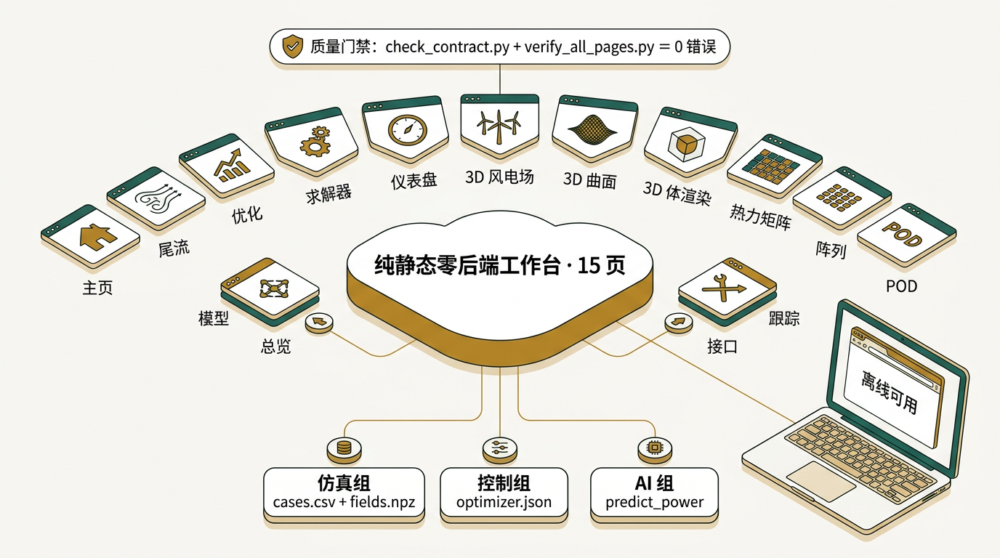

> **看图三秒：** 中央枢纽 15 页、底部三组契约、顶部门禁徽章——「0 错误」是唯一 KPI。

**本讲赌注：** 科研网页的「工程」不是「好看」，是**数字可溯源、链路不可断、断网仍可用**。

---

#### 1. 生活与物理直觉引子：印刷地图 vs 实时地图

> **剧场：** 实时地图（传统 Web 应用）：手机每次都要连服务器，服务器是「地图工厂」；工厂一停，地图空白。
> 印刷地图（本项目）：地图「印」在纸上（data.js），手机没信号也能看——代价是「地图不变」，收益是「永远可用」。

| 地图元素 | 网页元素 |
| :--- | :--- |
| 地图工厂 | 后端服务器（不存在） |
| 印刷纸 | data.js（26.4 KB） |
| 看地图 | 浏览器插值 <0.5 ms |
| 地图不变 | 构建版本冻结（v1.3-final） |

> **先猜后揭：** 零后端的「代价」是什么？
> 揭晓：**数据不能「实时」**——它是预计算网格的「照片」，不是「直播」（第 08 讲已声明）。科研工作台用「可复现 + 离线 + 零运维」换「不实时」。

---

#### 2. 工程死穴：答辩的三个「必须」

- **断网备胎**：答辩现场可能断网——实时地图空白，印刷地图照常［README：Streamlit 是「离线探索与答辩断网备胎」，静态站更彻底］；
- **可复现**：老师当场「复算」数字，页面 → data.js → cases.csv 三步溯源；
- **零运维**：Cloudflare Pages 静态托管，构建命令留空、无环境变量、无服务器［HANDOFF 五］。

**团队的工程规范（「设计语言」也是契约）［HANDOFF 二］：**
- 莫兰迪浅色科研工作台；Songti SC Black 标题 + 等线正文，DM Mono / JetBrains Mono 数字；
- 1px 发丝线、Nature 规范三线表、**零 Emoji**；
- 速度场用 ColorBrewer BuGn 反向色阶：低速森林绿、高速浅薄荷。

> **为什么「去 AI 模板化」是工程决策而不是洁癖？** 圆角阴影卡片 + Emoji 的「商用 SaaS 味」在工科评委眼里是减分项；发丝线 + 三线表 + 等宽数字的「瑞士网格」传递的是**数据墨水比**（data-ink ratio）——每一像素都花在数据上［AUDIT 七、十九轮等视觉决策记录］。

---

#### 3. 数学公式从 0 到 1：两条「工程式」

##### 3B. 本讲符号卡

| 符号 | 人话 | 备注 |
| :--- | :--- | :--- |
| build_data.py | 「夜班工人」 | 纯标准库，重复构建哈希不变 |
| check_contract.py | 数据契约自检 | 退出码非 0 禁部署 |
| verify_all_pages.py | 全站质检 | 0 阻断错误 / 0 警告 |

##### 3C. 主路径只要两条式

**核心式 ① — 构建管线**
**〔式〕** CSV/JSON → build_data.py（纯标准库）→ data.js → 页面（interp.js <0.5 ms）
**回译：** 「纯标准库」是诚信装置——不依赖 pandas/numpy，任何机器算出同一个数（重复构建哈希不变［HANDOFF 审计］）。

**核心式 ② — 质量门禁**
**〔式〕** 可部署 ⟺ check_contract.py exit 0 ∧ verify_all_pages.py 0 错误 0 警告
**回译：** 数据契约自检（网格完整性、功率非负、增益公式一致、偏航 ±30° 域）+ 全站检查（15 页导航顺序、死链、JS 语法、离线依赖、伪数据、安全头）［HANDOFF 四］。

> 【深潜｜可跳过】
>
> - **15 页导航顺序：** index → wake → optimization → solver → dashboard → array → heatmap → pod → model → power_tracking → 3d_farm → 3d_surface → 3d_volume → interface → overview（00–13 + MAP）［HANDOFF 一］。
> - **3D 页的「数据诚实」：** 九机场景是「结构/策略示意」，双机速度纹理才读取 FLORIS 三维速度数据；首页 `bg.mp4` 是「数字孪生线框结构运行示意」，**不是 3×3 阵列尾流实录**［HANDOFF 三］。
> - **最终审计结果：** 0 阻断错误 0 警告；HTTP 71 个现役路由 200 / 8 个下线路由 404；36 PNG / 16 PDF / 2 WOFF2 / 1 MP4 文件签名通过；PPTX ZIP 结构通过［HANDOFF 四］。
> - **FREEZE 冻结规则：** 网页 2026-08-19 最终封板；只允许修复「明确运行错误、死链、数据错误、安全问题或文字溢出」五类，修复后必须重跑两道门禁［FREEZE.md / HANDOFF 六］。

---

#### 4. 值班手册

```text
问「服务器在哪」→ 没有服务器。数据在网页里。
问「数字是真的吗」→ 页面 → data.js → cases.csv，三步到源文件。
问「为什么长这样」→ 莫兰迪 + 发丝线是「工程师审美」：数据墨水比高于阴影。
问「能加功能吗」→ 冻结规则：只有五类修复可动；动完必跑两道门禁。
```
**一句话记住：网页是数字的「最后一公里」——可以丑，不可以假；可以简，不可以断。**

---

#### 5. 比分日

**先报胜负：** 15 页零后端站，两道门禁 **0 错误 0 警告**，71 路由全 200，v1.3-final 最终封板［HANDOFF］。

| 项 | 数值 | 来源 |
| :--- | :---: | :--- |
| 现役页面 | 15（+2 留档 HTML） | HANDOFF 一 |
| data.js | 26.4 KB | AUDIT 六 |
| 质量门禁 | 0 阻断 / 0 警告 | HANDOFF 四 |
| HTTP 路由 | 71×200 / 8×404 | HANDOFF 四 |
| 部署 | Cloudflare Pages，构建命令留空 | HANDOFF 五 |
| 单步推理 | <0.5 ms | 口袋卡 |

**体感换算：** 「服务器」成本 = 0 元/月；「值班」成本 = 0（静态）；「复现」成本 = 一条 git clone + 两条 python 命令。

---

#### 6. 可信度

| 维度 | 打分 | 人话 |
| :--- | :---: | :--- |
| 架构 | 5 | 零后端、可复现 |
| 门禁 | 4 | 契约 + 门禁双保险 |
| 审美 | 4 | 瑞士网格 + 发丝线，「反」商用 SaaS 阴影（团队价值选择） |
| 实时性 | 1 | 数据是「照片」不是「直播」（已声明的代价） |

**可以攻击的点：** ① 数据冻结——新增工况要「重新构建」；② 15 页维护面大（冻结是解法）；③ 3D 示意页的「示意 vs 数据」边界必须声明（已写进页脚/卡注）。
**承前：** 第 08 讲管线 → **启后：** 第 12 讲——网页建好了，但「数字曾经撒过谎」。

**附：口袋卡（可打印）**
> **零后端工作台**
> 15 页 · 26.4 KB · <0.5 ms · 0 错误 0 警告
> 溯源：页面 → data.js → cases.csv ｜ 门禁：两脚本 exit 0
> 冻结：五类修复可动，动完必跑门禁。

---

#### 章末：30 秒复述 · 掌握门自测

**30 秒复述稿（可朗读）：** 零后端 = 印刷地图：数据 build 时印进 data.js（26.4 KB），浏览器 <0.5 ms 推理，断网可用；两道门禁（契约 + 全站）0 错误才许部署；v1.3-final 封板，只有五类修复可动。反派「脆如玻璃」，破绽「没有服务器就没有玻璃」。

**自测（先做再对答案）：**

1. 「质量门禁」是哪两个脚本？各查什么？
2. 零后端的「代价」与「收益」各是什么？
3. 「三步溯源路径」是哪三步？

<details>
<summary>参考答案</summary>

1. `site/check_contract.py`（数据契约：网格完整性/功率非负/增益公式一致/±30° 域/新增字段校验）与 `site/verify_all_pages.py`（15 页导航、死链、JS 语法、离线依赖、伪数据残留、安全头）。
2. 代价：数据不实时（照片不是直播）；收益：离线可用、可位级复现、零运维成本。
3. 页面展示值 → data.js 注入值 → cases.csv/npz 源数据（同源文件）。

</details>

**元数据：** 证据等级 A｜复算路径 `python3 site/check_contract.py && python3 site/verify_all_pages.py`｜关联页 全部 15 页。

---

<a id="lec-12" name="lec-12"></a>
### 【第12讲】诚信审计：数字的八大战（反派：假数字）

#### 本讲开场 90 秒

**上讲闪回（第 11 讲）：** 网页「不可断」，但网页里的「数字」曾经「撒过谎」。

**本讲反派：** 「假数字」——最阴险的一种：它看起来自信、格式规范、位置正确，但**没有出处**。

**只要带走 3 句口诀：**

1. **算不出来的不写**：数字的唯一出生证明是「可复现」。
2. **坐实才修、驳倒跳过、如实记录**：审计不是「找茬」，是「信任的双式记账」。
3. **页面不能和自家图打架**：图是「证人」，文字是「被告」［AUDIT A］。


> **看图三秒：** 四步——扫描 → 复算 → 裁决 → 门禁；底部琥珀条「8 项编造坐实修正 · 0 残留 · 退出码 0」。

**本讲赌注：** 「假数字」是 AI 辅助研究里**唯一必须用制度防**的反派——因为它最「自信」。

---

#### 1. 生活与物理直觉引子：会计的双式记账

> **剧场：** 会计的第一条规矩：**没有凭证不能入账**。页面上的数字 = 账目，源文件 = 凭证。
> 「假数字」就像「无凭证入账」：账面上看着没问题，一「审计」就露馅。

| 会计元素 | 审计元素 |
| :--- | :--- |
| 无凭证入账 | 无出处的数字 |
| 审计 | AUDIT 台账（.learnings/AUDIT_20260810.md） |
| 双式记账 | Python 复算 × Node 复算（双语言一致） |
| 更正 | 修正 + 留痕 |
| 财务章 | check_contract.py 绿灯 |

> **先猜后揭：** 15 页站审计前有多少「编造」？
> 揭晓：**8 项坐实 + 2 处隐藏**——比你想的多。这正是「制度审计」而不是「我觉得没问题」的价值所在。

---

#### 2. 工程死穴：AI 生成的「自信编造」

审计抓到的三类「假数字」［AUDIT A~G/六］：

1. **数字「太干净」**：16 向风玫瑰表 E/W=18.5% 对称复制——真实世界有噪声，「完全相等」是编造指纹；
2. **数字「太大」**：850 万 kWh / 340 万 / 7000 吨碳减排——无计算路径、无出处，「越大越好」；
3. **产物「是幽灵」**：PPO 权重 .pt 文件 **0 字节**——文件名看着真，`ls -la` 是 0 B，train/eval/demo 三脚本逐字节相同且「不训练、不加载」［AUDIT C/七］。

**共性：它们看起来 100% 自信。** 这是 AI 辅助研究的死穴——编造不是「笔误」，是「自信的小说」。

---

#### 3. 数学公式从 0 到 1：审计的「算法」

##### 3B. 本讲符号卡

| 符号 | 人话 | 备注 |
| :--- | :--- | :--- |
| 坐实 | 独立复算 ∧ 不符确认 | 才允许修 |
| 驳倒 | 复核后判定清白 | 也记录（防误伤） |
| 双语言 | Python 复算 = Node 复算 | 交叉验证 |
| 残留扫描 | 旧值全站 grep | 98.1/82.4/18.5/1800×… → 0 |

##### 3C. 主路径只要两条式

**核心式 ① — 审计判定规则**
**〔式〕** 可修 ⟺ 独立复算 ∧ 坐实不符；否则跳过并记录（防误伤）
**回译：** 「坐实才修、驳倒跳过并如实记录」——审计不是「改得越多越好」，是「证据链」［AUDIT 前言：承泽确认「逐条二次复核，坐实才修；驳倒跳过并如实记录」］。

**核心式 ② — 双语言交叉验证**
**〔式〕** 复算_Python = 复算_Node（tandem +0.51%/23.1 万；array +8.86%/1430.1 万）
**回译：** 两套独立实现（Python/Node）复算同一数字，一致才算「交叉验证」［AUDIT 五 验证记录］。

**修正清单（八大战）［AUDIT 一］：**

| # | 位置 | 原值（编造/错口径） | 修正（复算值） |
| :--- | :--- | :--- | :--- |
| A | pod.html（7 处） | 82.4/15.7/累计 98.1% | 76.4/21.6/97.97%（独立 SVD 重算；模态 0 订正为反对称偶极子） |
| B | overview.html POD 卡 | 98.1% | 98.0%（精确 97.97%） |
| C | HANDOFF（3 处） | Row3 3.6 m/s；PPO 指标无保留 | 5.31 m/s；加「待复现/口径」注记 |
| D | optimization.html | 下游 4.1→7.2 m/s；「偏移约 45 m」 | 5.10→6.38 m/s；偏移 −43~−52 m（多站位验证） |
| E | index.html SVG 图注 | 清洁来流 7.2 m/s | 下游来流回升 6.4 m/s |
| F | interface / model 页 | 无来源说明 | 加交付状态与「图源级佐证」注记 |
| G | windrose.html 整页 | 16 向编造表 + 5.6% AEP + 850 万 kWh 等 | 12 向×4 速真实扫描；等权 ΔAEP +0.51%；删金额/碳排 |
| H | solver.html 算法表 | SLSQP 2.8 s；「1800×」；「二阶插值」 | 实测 14 次/0.46 s；≈700×/≈2700×；「双线性插值」 |

**两处隐藏编造［AUDIT 六］：** array.html 占位 3120 kW/+42.5% 等 + 统一策略 `pwr` 硬编码伪数组 [1460/920/660×3]（与真口径「仅 Row 1 +30°」不符）→ 全部骨架化 + 换真实行和。

> 【深潜｜可跳过】
>
> **审计的「阴性记录」（防误伤，同样入册）：** array.html KPI 占位值被 JS 运行时真实值覆盖、仅首屏瞬间可见 → 判 P2 瑕疵非错误；主页「2 模态覆盖 98%」是 97.97% 的合理圆整 → 判无问题；部署首页抓到的 −17°/−5.5% 是计数动画初值 0% 的抓取伪影 → 线下源码核对无此问题［AUDIT 二］。
> **审计是「证据法」，不是「有罪推定」。**

---

#### 4. 值班手册（宪法条款）

```text
第 1 条：假设显式化（TI 6%、等权口径、稳态——全部写出来）
第 2 条：数字无出处禁写（有出处写注记；没出处不写）
第 3 条：死代码/旧文件不动（只记录，尊重留档）
第 4 条：修完必重跑两道门禁（退出码是「印章」）
```
［宪法原文见审计台账前言与 FREEZE.md］
**一句话记住：数字的可信不是「我说是真的」，是「你复算它是真的」。**

---

#### 5. 比分日

**先报胜负：** 8 项编造全部坐实修正，2 处隐藏编造深挖订正，全站残留复扫 **0 残留**，两道门禁绿灯［AUDIT］。

| 审计动作 | 数量 |
| :--- | :---: |
| 编造坐实修正 | 8 项（A~H） |
| 隐藏编造深挖 | 2 项（占位伪值 / 伪功率数组） |
| 阴性记录（防误伤） | 3 项 |
| 残留复扫 | 0（98.1/82.4/15.7/3.6/18.5/5.6%/1800×… 全部清零） |
| 门禁 | check_contract + verify_all_pages 全绿 |

**体感换算：** 审计成本 = 一轮复算 + 一轮修正；换来的 = **全组任何人「敢把任何数字说出来」**——这是答辩的「资产」，比任何新页面都值钱。

---

#### 6. 可信度

| 维度 | 打分 | 人话 |
| :--- | :---: | :--- |
| 方法 | 5 | 独立复算 + 双语言 + 阴性记录三件套 |
| 覆盖 | 4 | 全站硬编码扫描 + 产物签名校验 |
| 局限 | 3 | 审计是「快照」（2026-08-10），后续变更需再审计 |
| 制度化 | 5 | 门禁进部署流程（失败即禁部署） |

**可以攻击的点：** ① 审计依赖「FLORIS 本地复算可信」这一前提；② XGBoost 图源无法审计（原始压缩包不在仓）——这是「审计盲点」，已诚实声明。
**承前：** 第 01~11 讲的所有数字「出自」这里 → **启后：** 第六篇——数字真了，「软肋」还在哪？

**附：口袋卡（可打印）**
> **八大战**
> 8 项坐实修正（POD 82.4→76.4、1800×→≈2700×、16 向表→12 向扫描…）
> 2 处隐藏（0B 权重→55 KB 实跑；伪数组→真实行和）
> 0 残留 ｜ 退出码 0 = 印章

---

#### 章末：30 秒复述 · 掌握门自测

**30 秒复述稿（可朗读）：** 假数字最自信，所以要制度审计：扫描硬编码 → FLORIS 独立复算 → 坐实才修、驳倒跳过并记录 → 残留复扫 0 + 门禁绿灯。8 项坐实、2 处隐藏、3 项阴性记录。反派「假数字」，破绽「无凭证不入账」。

**自测（先做再对答案）：**

1. 三类「假数字」各是什么？共性是什么？
2. 「驳倒跳过并如实记录」是什么意思？为什么不能「顺手就改」？
3. 举一个「阴性记录」例子，说明它为什么「无问题」。

<details>
<summary>参考答案</summary>

1. 「太干净」（对称复制 18.5%）、「太大」（850 万 kWh 无出处）、「是幽灵」（0B 权重）；共性：看起来 100% 自信、无凭证。
2. 审计是证据法：没有「坐实」证据就修改，会引入新的「自信错误」；记录阴性结论防止下一个人重复怀疑、也防止误伤。
3. 例：主页「98%」是 97.97% 的合理圆整 → 无问题；或 −17° 是计数动画初值的抓取伪影 → 源码核对无此问题。

</details>

**元数据：** 证据等级 A（审计本身）｜复算路径 `.learnings/AUDIT_20260810.md` 全程留痕｜关联页 `site/` 全站。

---
<a id="part-6" name="part-6"></a>
# 第六篇 【对比、批判与前瞻篇】

<a id="sec-6-0" name="sec-6-0"></a>
### 6.0 十二讲口诀墙（一张纸版）

| 讲 | 反派 | 三句口诀（压缩版） |
| :---: | :--- | :--- |
| 01 | 风贼 | 低速+高湍流；卷吸自恢复；5D 是分水岭 |
| 02 | 自损 | cos^1.88；CVP 推歪 43~52 m；让 16.8 找补 108.4 净赚 8.13 |
| 03 | 慢如蜗牛 | CFD 准而贵；GCH 五件套；7536 次 339 s |
| 04 | 瞎搜 | 先便宜路后贵路；三家到同一处；0.6 ms vs 1.80 s |
| 05 | 一刀切 | 前排让利中排借道后排满发；20° 胜 30°；5.31>5.10 |
| 06 | 单风向 | 8 非零几何全解释；四斜向 0；ΔAEP +8.86% |
| 07 | 全存 | 两笔就够；推走 76.4 补回 21.6；97.97% |
| 08 | 贵如登月 | build 注入；26 KB + <0.5 ms；可信域是生命线 |
| 09 | 每次重算 | 肌肉记忆；4 维契约；±5°/step |
| 10 | 追风 | 76.31% 地板；低于地板永不收敛；[0.78,0.98] |
| 11 | 脆如玻璃 | 服务器退休；15 页一套契约；两道门禁 |
| 12 | 假数字 | 算不出来的不写；坐实才修驳倒跳过；页面不与图打架 |

<a id="sec-6-1" name="sec-6-1"></a>
### 6.1 全景对比矩阵

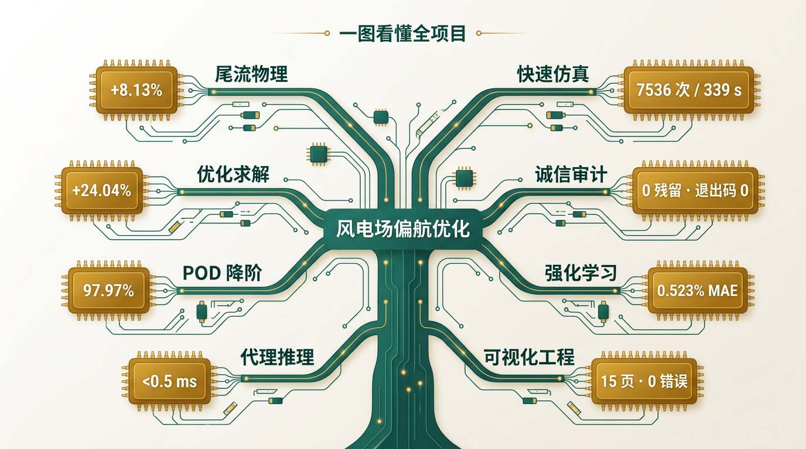

> **指读：** 主干是「风电场偏航优化」，八个分支对应全书五篇；叶片上的关键数字（+24.04%、97.97%、0.523%、<0.5 ms、ΔAEP +8.86%、7536/339 s、15 页 0 错误）就是答辩的「弹药清单」。

**五条技术路线横向对比：**

| 维度 | 暴力扫描 | 优化器（SLSQP/DE） | 逐排贪心 | 代理插值 | PPO |
| :--- | :--- | :--- | :--- | :--- | :--- |
| 回答什么 | 「全部可能」 | 「本工况最优」 | 「九机分工」 | 「秒答」 | 「一步步怎么走」 |
| 耗时 | 339 s（48 条件） | 0.46~1.80 s/条件 | 157 次/条件 | <0.5 ms | 0.944 s 稳态调节 |
| 全局性 | 网格点内 | 单峰可 / 多峰不可 | 不可（下限） | 不可（网格粗细） | 不可（局部策略） |
| 有状态？ | 无 | 无 | 顺序依赖 | 无 | **有**（当前偏航） |
| 本项目用途 | 数据底座 | 离线验证 | 阵列策略 | 网页实时 | 功率跟踪 |

<a id="sec-6-2" name="sec-6-2"></a>
### 6.2 横向批判：六个共享软肋

把六个软肋放上可信度刻度——**软肋不是污点，是选题富矿**：

1. **「真值」缺失**（最大软肋）：FLORIS vs CFD vs 现场——仓库内没有三方对照；所有数字是「FLORIS 口径内自洽」，不是「对真实世界验证」。［第 03 讲 §6］
2. **贪心只是下限**：逐机 vs 逐排已推翻包含关系假设；真正的 13³ 组合全局最优未搜索。［第 05 讲 §6］
3. **PPO 是「单机简化环境」**：cos^1.88 单机定律，不是完整 FLORIS 场；多机协同（MADDPG）是待办。［第 09 讲 §6］
4. **POD 是「单快照」**：一个稳态截面；时变（序列）与三维降阶未覆盖。［第 07 讲 §6］
5. **XGBoost 仓内不可重训**：图源级佐证；申请书「预测误差 <5%」承诺（C 级）无仓内验证。［第 08 讲 §6］
6. **稳态单风向 + 等权口径**：无尾流蜿蜒、无风频加权——ΔAEP +8.86% 是「简化年度口径」，不是实测 AEP。［第 06 讲 §6］

<a id="sec-6-3" name="sec-6-3"></a>
### 6.3 前瞻选题：从六个软肋直接生长出来

对照申请书六步路线［申请书，C 级］，每个软肋都是一个可生长的选题：

| 软肋 | 前瞻选题 | 申请书路线对应 |
| :--- | :--- | :--- |
| ① 无真值 | LES 高保真快照 + FLORIS「校准实验」（建 ground truth） | 步骤一 OpenFOAM/LES |
| ② 贪心下限 | 13³ 组合全局搜索 / 多起点 / 进化算法（把「下限」抬成「最优」） | 步骤五 全局协同 |
| ③ 单机 RL | PPO 环境接完整 FLORIS 场 + 多机 MADDPG 协同 | 步骤五 |
| ④ 单快照 POD | 时变 POD（DMD/TPOD）+ 尾流蜿蜒 | 步骤二 POD + PINN |
| ⑤ 代理不可重训 | XGBoost/PINN 代理仓内重训 + 5% 误差验证（10~50 ms 目标） | 步骤三 |
| ⑥ 等权口径 | 真实风玫瑰联合概率加权 + 3×3 微风机半实物验证 | 步骤六 |

**一句话：** 每个「软肋」都是「论文题」——这是白皮书交给你的**选题矿脉**。

<a id="sec-6-4" name="sec-6-4"></a>
### 6.4 已删除的旧版虚构数字（公示，避免复现）

以下数字**曾出现在项目页面/文档中，已被审计坐实为编造或口径错误，今后一律不得引用**［AUDIT］：

| 已删数字 | 正确值/处置 |
| :--- | :--- |
| POD 82.4 / 15.7 / 累计 98.1% | 76.38 / 21.58 / 97.97%（独立 SVD） |
| 第三排均速 3.6 m/s | 5.31 m/s（Row1 7.97 / Row2 5.10） |
| 下游风速 4.1 → 7.2 m/s、「偏移约 45 m」 | 5.10 → 6.38 m/s；偏移 −43~−52 m（−y 侧） |
| 16 向风玫瑰表（E/W=18.5%）、+5.6% AEP、850 万/340 万 kWh、7000 吨碳减排 | 全部删除；12 向真实扫描，等权 ΔAEP +0.51%（两机） |
| SLSQP 35~60 次 / 2.8 s、GA >500 次 / 24.5 s、「提速 1800×」 | 14 次 / 0.46 s、56 次 / 1.80 s、≈700×/≈2700× |
| array.html 占位 3120 kW / +42.5% / 2901 kW / +96.8%、伪功率数组 1460/920/660×3 | 8095.15 / 9299.05 / 10041.46 kW 与真实行和 |
| 「二阶插值」 | 双线性插值 |
| 0 B PPO 权重文件 | 55,420 B 实跑复现权重 |

**阅读纪律：** 在旧截图/旧 PPT 里见到这些数字，一律视为**作废**——审计台账是唯一口径。

<a id="sec-6-5" name="sec-6-5"></a>
### 6.5 全书收口：一句话版

**先把「下一次评估」变聪明（第二篇：插值/优化/贪心），再把「一次评估」变便宜（第一、三篇：FLORIS/POD/代理），最后让机器学会物理本身（第四篇：PPO 可达域）——并用制度守住所有数字（第五篇：契约/门禁/审计）。**

这就是全项目的「心法」，也是全书的一句话。

---

<a id="appendix" name="appendix"></a>
# 附录

<a id="app-a" name="app-a"></a>
## 附录 A 符号总表

| 符号 | 人话 | 出现讲次 |
| :--- | :--- | :--- |
| u∞ | 来流风速（m/s） | 01、03、06 |
| u(x,y) | 尾流内局部风速 | 01 |
| Δu | 速度亏损 u∞ − u | 01 |
| TI | 湍流强度（本项目 6%） | 01、03 |
| D | 转子直径 126 m；5D = 630 m | 01 |
| γ | 偏航角（±30°） | 02、04、05 |
| cos^1.88(γ) | 偏航功率损失因子 | 02、09、10 |
| P1/P2 | 上/下游单机功率 | 02 |
| Pbase / Ptot | 基线 / 全场功率 | 02~06 |
| GCH | FLORIS 快尾流模型五件套 | 03 |
| 13 点 / 12 向 / 4 速 | 偏航 −30~30 步长 5°；风向步长 30°；6~12 m/s 内 4 档 | 03、06 |
| ΔAEP% | 等权功率加权年度增益（简化口径） | 06 |
| U(64×128) | 流场矩阵（8192 维） | 07 |
| σᵢ / φᵢ / ψᵢ | SVD 奇异值 / 空间模态 / 强度 | 07 |
| Eᵢ = σᵢ²/Σσ² | 模态能量占比 | 07 |
| s, t | 双线性插值权重 | 04、08 |
| predict_power | AI 组契约函数（含诚信字段） | 08 |
| s=[u∞,yaw,P,P_target] | PPO 4 维观测契约 | 09 |
| a = Δyaw ∈ ±5°/step | PPO 动作域 | 09 |
| r = −\|err\| − 0.05\|a\| | PPO 奖励 | 09 |
| P_base | 简化环境满发功率（0.5ρπ63²C_P u³/1000） | 09、10 |
| 76.31% | 偏航可达下界 cos^1.88(30°) | 10 |
| [0.78, 0.98] | PPO 目标收敛域（×P_base） | 10 |
| check_contract / verify_all_pages | 两道质量门禁脚本 | 11、12 |

<a id="app-b" name="app-b"></a>
## 附录 B 复现指南

```bash
# 环境：requirements.txt 已锁定（Python 3.11 审计 / 3.13 开发；FLORIS 钉死 4.6.6）
# 数据底座（FLORIS 扫描）
python generate_data.py              # 两台串列 8 m/s × 13 偏航 → cases.csv + fields/
python generate_multiwind_data.py    # 4 风速 × 13 偏航 → cases_multi.csv
python generate_3d_data.py           # 5 偏航 × 9 高度层 → fields_3d/
python generate_array_data.py        # 3×3 阵列统一偏航 → cases_array.csv
python generate_array_independent.py # 阵列逐排贪心 → array_independent_result.json
python generate_windrose_data.py     # 12 风向 × 4 风速 × 13 偏航 → cases_windrose*.csv
python pod_analysis.py               # POD/SVD 分解 → pod_results/

# 网页数据注入 + 两道门禁（部署前必跑，任一失败禁部署）
python3 site/build_data.py
python3 site/check_contract.py
python3 site/verify_all_pages.py

# 求解器 benchmark（solver 页算法对比表复跑口径）
python3 site/benchmark_solver.py

# PPO 复现（600 迭代训练 + 200 回合独立评测）
cd 20260810洪/extracted
python ppo_repro_train.py
python ppo_repro_eval.py             # → metrics_repro.json + ppo_eval_traces.json

# 审计台账（全书数字的「判决书」）
cat .learnings/AUDIT_20260810.md
```

> **纪律：** 任何数字改动必须附复算路径，并重跑两道门禁［README 仓库治理］。

<a id="app-c" name="app-c"></a>
## 附录 C 术语表（中英对照）

| 中文 | 英文 | 一句话 |
| :--- | :--- | :--- |
| 尾流 | Wake | 风机身后的低速高湍流区 |
| 偏航（转向） | Yaw (steering) | 旋转机舱避开/让开尾流 |
| 速度亏损 | Velocity deficit | u∞ − u |
| 卷吸 | Entrainment | 干净空气拖入尾流、促自恢复 |
| 反向旋转涡对 | Counter-Rotating Vortex Pair (CVP) | 偏航偏转尾流的物理执行者 |
| 高斯尾流模型 | Gaussian wake model | FLORIS GCH 的数学内核 |
| 年发电量 | AEP (Annual Energy Production) | 风频加权的全年发电；本书用等权简化口径 |
| 本征正交分解 / 奇异值分解 | POD / SVD | 流场矩阵按能量排序的「笔画分解」 |
| 代理模型 | Surrogate model | 快而糙的「替身」（插值/XGBoost） |
| 双线性插值 | Bilinear interpolation | 小矩形四角加权，<0.5 ms |
| 可信域 | Validity domain | 6~12 m/s、±30°；越界拒答 |
| 近端策略优化 | PPO (Proximal Policy Optimization) | 小步更新的 Actor-Critic 强化学习 |
| 物理可达域 | Physical reachability domain | 控制自由度决定的功率边界（76.31% 地板） |
| 数字孪生 | Digital twin | bg.mp4 的诚实口径：线框结构运行示意 |
| 零后端 | Zero backend | 数据注入页面，浏览器即计算机 |
| 质量门禁 | Quality gate | 契约自检 + 全站质检，失败禁部署 |
| 诚信审计 | Integrity audit | 坐实才修、驳倒跳过、如实记录 |
| 贪心下限 | Greedy lower bound | 局部搜索解只保证「不低于」，不保证「最优」 |
| 边际递减 | Diminishing returns | 四阶梯增量 +1204 → +636 → +107 |

<a id="app-d" name="app-d"></a>
## 附录 D 口袋手卡（进组会会议室前 3 分钟）

> 摘编自《8.23组会_口袋金句与避坑手卡_闪电记忆版.md》，与本书口径一致。

**4 大质询 · 闪电金句：**

1. **为什么第二排转 20° 胜过 30°？**
「转得少，迎风投影（cosγ）更大，过风多，第二排多发 432 kW；20° 足够让开后排，全场净赚 107 kW。」——前排适度让利与余弦损失的最优多行气动博弈。
2. **为什么第三排均速（5.31 m/s）比第二排（5.10 m/s）高？**
「10D 长途传播被周围干净大气卷吸牵扯，风速自恢复补齐。」——湍流卷吸与尾流自恢复，仿真忠实反映真实大气常识。
3. **为什么不用后端服务器，前 2 个 POD 模态能抓 97.97%？**
「模态 0 反向涡对 (CVP) 把尾流【推走】(76.4%) + 模态 1 中心动量【补回】(21.6%) = 97.97%。」——反对称偶极子与中心动量恢复模态的正交特征分解。
4. **为什么 PPO 必须约束在 [0.78, 0.98]×P_base？**
「偏航 ±30° 余弦下界 76.31%，低于下界纯偏航物理够不着（那是变桨的活）。」——偏航纯控制余弦下界约束定律，消除不可达残差，0.523% MAE 闭环。

**防翻车 3 条口诀：**

1. **「没后端，纯前端」**：全站浏览器内插值 <0.5 ms，断网也讲得动。
2. **「讲分工，显大局」**：田铭雨 CFD、袁夫达 POD、洪祖名 PPO、我打通全链数据契约与 15 页工作台。
3. **「对契约，真诚信」**：上台前 check_contract.py 绿灯；全仓 0 造假值、0 Emoji、0 圆角阴影卡片。

**核心数字速查（绝对真值）：**

- 两机 5D 避让账本：上游 1754→1459 kW（−16.8%）；下游均速 5.10→6.38 m/s、436→909 kW（+108.4%）；全场净多 +8.13%（+178 kW）
- 3×3 四阶梯：8095 → 9299（+14.9%）→ 9935（+22.7%）→ **10041 kW（+24.04% 推荐解）**
- 全风向：东西主向最强 +24.04%；等权 ΔAEP +8.86%（≈1430 万 kWh/年）
- PPO：稳态 MAE 0.523%（<1.2%）、调节延时 0.944 s、稳态零抖动

<a id="app-e" name="app-e"></a>
## 附录 E 团队与里程碑

| 成员 | 分工 | 模块产物 |
| :--- | :--- | :--- |
| 厉今飞（主持） | 基线数据 | cases*.csv 扫描矩阵 |
| 田铭雨 | CFD 仿真 | fields/*.npz、fields_3d/ 流场切片 |
| 袁夫达 | POD / 代理 | pod_results/、代理模型交付 |
| 洪祖名 | 优化 / PPO | 贪心策略、PPO 权重与复现管线 |
| 孙承泽 | 可视化与交互 | site/ 15 页静态站、门禁脚本 |
| 李良星 副教授 | 指导教师 | 动力工程多相流国家重点实验室 |

**里程碑：**

| 时间 | 事件 |
| :--- | :--- |
| 2026-03-27 | 大创申请书提交（融合数据-物理驱动的风电流场感知与智能调控研究） |
| 2026-04 | 项目启动（实施周期 2026.4–2027.6） |
| 2026-08-08/09 | 代理模型优化交付、单机 PPO 功率跟踪交付 |
| 2026-08-10 | 全站数字诚信审计（八大战 + PPO 复现闭环 + 16 页全景质检 + 8.23 组会材料） |
| 2026-08-19 | v1.3-final 最终封板（15 页静态站，Cloudflare Pages） |
| 2026-08-23 | 组会汇报（可视化暑期进展） |
| 2027-06 | 计划结题（申请书进度安排） |

---

<a id="final-quiz" name="final-quiz"></a>
## 全书终测（10 题 · 掌握门）

做完这 10 题，你才配说「我读完了这本白皮书」。

1. 用一句话向完全不懂风的人解释「风电场让利策略」。
2. 写出两机 25° 账本：让利多少（kW）、找补多少（kW）、净赚多少（%）。
3. 写出 3×3 四阶梯的四个功率值与推荐解的排角度向量。
4. 为什么 Row 2 转 20° 比 30° 好？用两排账本说明。
5. 风玫瑰 8 个非零扇区，几何原因各是什么？四个斜向为什么 ≈0？
6. POD 两笔分别是什么物理动作？前两阶累计能量占比？
7. `predict_power` 的两个「诚信字段」是什么？它们防住什么事故？
8. 76.31% 地板公式？[0.78, 0.98] 收敛域为什么下界不贴地板？
9. 网页数字「三步溯源」是哪三步？两道门禁脚本叫什么？
10. 举 3 个「已删除的旧版虚构数字」及正确值。

<details>
<summary>参考答案</summary>

1. 前面的风机把自己接到的风让出一部分（转一下机舱），后面的风机就能吃上干净风，全场总发电量反而变多。
2. 让利 295 kW（上游 1754→1459，−16.8%）；找补 473 kW（下游 436→909，+108.4%）；净赚 +8.13%（+178 kW）。
3. 8095.15 / 9299.05 / 9934.99 / 10041.46 kW；推荐解 [30°, 20°, 0°]（+24.04%）。
4. Row 2：20° 比 30° 少余弦损失、多发 432 kW；Row 3：因 Row 2 让得略少，少发 334 kW；净 +107 kW——让利有平衡点。
5. 90°/270° 沿 5D 排轴（对齐机距 5D）→ +24.05%/+24.04%；0°/180° 沿 3D 列轴 → +21.60%；60°/120°/240°/300° 沿晶格对角（斜距 ≈5.83D，对齐角差约 1°）→ +10.74~11.32%；四个斜向无对齐机位、无「前排-后排」角色 → 0。
6. 模态 0 = CVP 偶极子「推走」（76.38%）；模态 1 = 中心动量「补回」（21.58%）；累计 97.97%。
7. outOfRange 与 reasons；防住「越界硬答」——可信域（6~12 m/s、±30°）外不回答，把诚实写进 API。
8. cos^1.88(30°) = 0.76306 ≈ 76.31%；下界 0.78 留 1.7 个点控制余量，避免策略贴着地板「撞墙」。
9. 页面展示值 → data.js 注入值 → cases.csv/npz 源数据；`site/check_contract.py` 与 `site/verify_all_pages.py`。
10. 例：POD 82.4/15.7/98.1% → 76.38/21.58/97.97%；「提速 1800×」→ ≈700×/≈2700×；16 向风玫瑰表（E/W=18.5%）→ 12 向真实扫描；0B PPO 权重 → 55,420 B 实跑权重（任举 3 个）。

</details>

---

> **导师的最后一句话：**
> 白皮书的终点不是「读完」，而是**「复算」**——把附录 B 的命令真的跑一遍，把 2190.39、10041.46、97.97%、0.523% 这四个数字亲手从 CSV 里「打」出来。那一刻，这本书就从「别人的知识」变成「你的知识」了。
> ——你的深导师，2026-09-09
